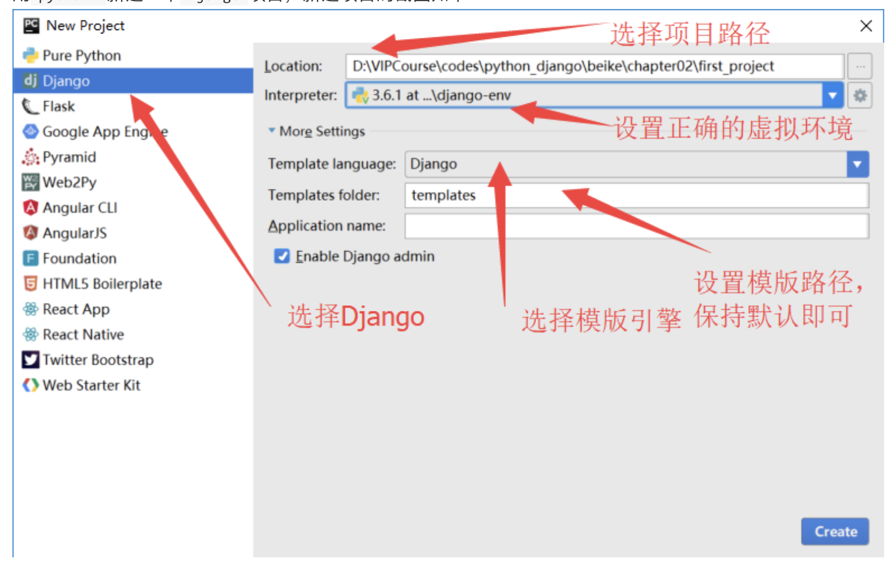

# 第一个Django项目

> Step1:	首先查看电脑中安装了哪些虚拟环境
>
> Step2:	进入到虚拟环境
>
> Step3:	查看当前虚拟环境中安装了哪些包
>
> ​			如果没有安装django包
>
> Step4:	在虚拟环境中创建项目, 在当前目录下创建项目

## 创建`Django`项目：

### 用命令行的方式：

1. 创建项目：打开终端，使用命令：`django-admin startproject [项目名称]`即可创建。比如：`django-admin startproject first_project`。

   > 只要在虚拟环境中安装了django, 就可以使用django-admin命令
   >
   > 在终端中哪个位置创建的, 就会把项目创建在哪个目录下

   *思考: 当前创建的项目下有哪些文件?*

   > 
   >
   > 1. `manage.py`：以后和项目交互基本上都是基于这个文件。一般都是在终端输入`python manage.py [子命令]`。可以输入`python manage.py help`看下能做什么事情。除非你知道你自己在做什么，一般情况下不应该编辑这个文件。
   > 2. `settings.py`：本项目的设置项，以后所有和项目相关的配置都是放在这个里面。
   > 3. `urls.py`：这个文件是用来配置URL路由的。比如访问`http://127.0.0.1/news/`是访问新闻列表页，这些东西就需要在这个文件中完成。
   > 4. `wsgi.py`：项目与`WSGI`协议兼容的`web`服务器入口，部署的时候需要用到的，一般情况下也是不需要修改的。

   

2. 创建应用（app）：一个项目类似于是一个架子，但是真正起作用的还是`app`。在终端进入到项目所在的路径，然后执行`python manage.py startapp [app名称]`创建一个app。

   > 将在终端需要做的事情图形化, 直接通过图形界面, 点击鼠标进行操作 
   >
   > 注意: pycharm选择perfessional版本 不能选择conmunication版本

### 用`pycharm`的方式：

用`pycharm`新建一个`Django`项目，新建项目的截图如下：

使用`pycharm`创建完项目后，还是需要重新进入到命令行单独创建`app`的。

## 运行Django项目：

> 首先通过命令行cd到项目文件夹下, 进入到项目目录中, 执行命令行语句运行项目

1. 通过命令行的方式：`python manage.py runserver`。这样可以在本地访问你的网站，默认端口号是`8000`，这样就可以在浏览器中通过`http://127.0.0.1:8000/`来访问你的网站啦。如果想要修改端口号，那么在运行的时候可以指定端口号，`python manage.py runserver 9000`这样就可以通过`9000`端口来访问啦。
2. 通过`pycharm`运行。直接点击右上角的绿色箭头按钮即可运行。

###让同局域网中的其他电脑访问本机的项目：

1. 在`settings.py`文件中，配置`ALLOWED_HOSTS`，将本机的ip地址添加进去。示例代码如下：

   ```python
   ALLOWED_HOSTS = ['*',]
   ```

## DEBUG模式：

默认情况下新建一个项目, debug模式为True:

1. 如果开启了DEBUG模式，那么以后我们修改了Django项目的代码，然后按下ctrl+s，那么Django就会自动的给我们重启项目，不需要手动重启。

   > 以往, 如果在项目中修改了代码, 需要重启项目, 才能看到修改之后的效果
   >
   > 现在只需要将debug模式开启就可以了

2. 如果开启了DEBUG模式，那么以后Django项目中的代码出现bug了，那么在浏览器中和控制台会打印出错信息。

3. 在生产环境中，禁止开启DEBUG模式，不然有很大的安全隐患。

   > 线上运行, 为了保障代码安全性, 关闭debug模式

4. 如果将DEBUG设置为False，那么必须要设置ALLOWED_HOSTS.

## ALLOWED_HOSTS：

这个变量是用来设置以后别人只能通过这个变量中的ip地址或者域名来进行访问。
