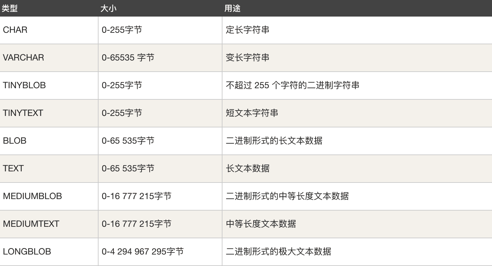

# 数据库的操作

## 一、SQL语言

### 1.1 什么是SQL

SQL是结构化查询语言（Structured Query Language）

### 1.2 SQL的作用

客户端使用SQL来操作服务器

​	启动mysql，会连接到服务器后，就可以使用sql来操作服务器了

​	将来会使用python程序(也可以是其他程序，比如java)链接服务器，然后使用sql来操作服务器

### 1.3 SQL标准

由国际标准组织(ISO)制定的，对DBMS的统一操作方式(例如相同的语句可以操作：mysql，oracle等)。

例如SQL99，即1999年制定的标准

> SQL99
>
> （1）是操作所有关系型数据库的规则 
> （2）是第四代语言 
> （3）是一种结构化查询语言 
> （4）只需发出合法合理的命令，就有对应的结果显示

注意，某种DBMS不只会支持SQL标准，而且还会有一些自己独有的语法，比如limit语句只在MySQL中可以使用

### 1.4 SQL的语法

1. SQL语句可以在单行或多行书写，以分号结尾

   ​	有些时候可以不以分号结尾，比如代码中

2. 可以使用空格和缩进来增强语句的可读性

3. MySQL不区分大小写，建议使用大写

### 1.5 SQL99标准的四大分类 ：

1. DDL数据定义语言（data definition language）

   ​	create table,alter table，drop table，truncate table 。。

2. DML数据操作语言（Data Manipulation Language）

   ​	insert,update,delete 

3. DQL数据查询语言（data query language）

   select

   其实DQL也从DML中分离出来的。

4. DCL数据控制语言（Data Control Language）

   ​	grant 权限 to scott，revoke 权限 from scott 。。。 

5. DCL（事务控制语言）：commit，rollback，rollback to savepoint 。。。


## 二、 数据库的基本操作

配置环境变量

> MYSQL_HOME：C:\Program Files\MySQL\MySQL Server 5.7
>
> Path：%MYSQL_HOME%\bin
>
> 或Path：C:\Program Files\MySQL\MySQL Server 5.7\bin

### 2.1 在终端连接`mysql`数据库

在终端输入如下命令:

```sql
mysql -u root -p
```

回车后输入密码.

### 2.2 查看数据库版本

```sql
select version();
```

注意:输入命令的时候不要忘记后面的分号

### 2.3 查看当前时间

```sql
select now();
```

### 2.4 退出`mysql`数据库的连接

`exit`或`quit`


------

**以下操作都是在连接数据库之后才能做的操作**

注意命令结束的时候一定要带分号.

### 2.5 显示所有的数据库

```sql
show databases;
```

注意: `databases`后面有个`s`

### 2.6 创建数据库

```sql
create database [if not exists] 数据库名 [default charset utf8 collate utf8_general_ci];
```

说明: 

1. 数据库名不要使用中文

2. 由于数据库中将来会存储一些`非ascii`字符, 所以务必指定字符编码, 一般都是指定`utf-8`编码

3. CHARSET 选择 utf8 
   COLLATION 选择 utf8_general_ci 

   > 数据库的校验规则:
   >
   > ​	utf8_bin：区分大小写；
   >
   > ​	utf8_general_cs：大小写敏感；
   >
   > ​	utf8_general_ci：大小写不敏感。

4. mysql中字符集是utf8，不是utf-8。

### 2.7 切换到要操作的数据库

若要操作数据库中的内容, 需要先切换到要操作的数据库

```sql
use 数据库名;
```

### 2.8 查看当前选择的数据库

```sql
select database();
```

### 2.9 删除数据库

```sql
drop database [if exists]数据库名;
```


## 三、MySQL 数据类型

MySQL中定义数据字段的类型对你数据库的优化是非常重要的。 MySQL支持多种类型，大致可以分为三类：数值、日期/时间和字符串(字符)类型。

### 3.1 数值类型

MySQL支持所有标准SQL数值数据类型。 这些类型包括严格数值数据类型(INTEGER、SMALLINT、DECIMAL和NUMERIC)，以及近似数值数据类型(FLOAT、REAL和DOUBLE PRECISION)。 关键字INT是INTEGER的同义词，关键字DEC是DECIMAL的同义词。 BIT数据类型保存位字段值，并且支持MyISAM、MEMORY、InnoDB和BDB表。 作为SQL标准的扩展，MySQL也支持整数类型TINYINT、MEDIUMINT和BIGINT。下面的表显示了需要的每个整数类型的存储和范围。


**在上面表中的类型中, 最常用的是2中类型: int(整数)和decimal(浮点数).**


### 3.2 日期和时间类型

表示时间值的日期和时间类型为DATETIME、DATE、TIMESTAMP、TIME和YEAR。 每个时间类型有一个有效值范围和一个"零"值，当指定不合法的MySQL不能表示的值时使用"零"值。 TIMESTAMP类型有专有的自动更新特性，将在后面描述。


**最常用: datatime类型.**


### 3.3 字符串类型

字符串类型指CHAR、VARCHAR、BINARY、VARBINARY、BLOB、TEXT、ENUM和SET。该节描述了这些类型如何工作以及如何在查询中使用这些类型。 CHAR和VARCHAR类型类似，但它们保存和检索的方式不同。它们的最大长度和是否尾部空格被保留等方面也不同。在存储或检索过程中不进行大小写转换。 BINARY和VARBINARY类类似于CHAR和VARCHAR，不同的是它们包含二进制字符串而不要非二进制字符串。也就是说，它们包含字节字符串而不是字符字符串。这说明它们没有字符集，并且排序和比较基于列值字节的数值值。 BLOB是一个二进制大对象，可以容纳可变数量的数据。有4种BLOB类型：TINYBLOB、BLOB、MEDIUMBLOB和LONGBLOB。它们只是可容纳值的最大长度不同。 有4种TEXT类型：TINYTEXT、TEXT、MEDIUMTEXT和LONGTEXT。这些对应4种BLOB类型，有相同的最大长度和存储需求。



**最常用的: char, varchar和text类型.**

> 总结常用的类型：
>
> int：整型
>
> double：浮点型，例如double(5,2)表示最多5位，其中必须有2位小数，即最大值：999.99
>
> decimal：浮点型，不会出现精度缺失问题，比如金钱。
>
> char：固定长度字符串类型：最大长度：char(255)
>
> varchar：可变长度字符串类型：最大长度：varchar(65535)
>
> text(clob)：字符串类型，存储超大文本。
>
> blob：字节类型，最大4G
>
> date：日期类型，格式为：yyyy-MM-dd
>
> time：时间类型：格式为：hh:mm:ss
>
> timestamp：时间戳
>
> datatime


## 四、表的基本操作

MySQL不仅用于表数据操纵，而且还可以用来执行数据库和表的所有操作，包括表本身的创建和处理。

**数据库中存储的是表(table), 表中存储的是一行行的数据.**

### 4.1 查看当前数据库中的所有表

```sql
show tables;
```

注意: `tables`后面有个`s`

### 4.2 创建表

通用语法：**CREATE TABLE table_****\*name (column_name column_type);***

```sql
CREATE TABLE [IF NOT EXISTS] 表名(
	列名 列类型(长度) 约束 默认值,
  	列名 列类型(长度) 约束 默认值,
  	...
); 

例如:
create table student(
    id int auto_increment primary key,
    name varchar(16) not null, 
    age int, 
    sex char(1));
```

在这里，一些数据项需要解释：

- 字段使用NOT NULL，是因为我们不希望这个字段的值为NULL。 因此，如果用户将尝试创建具有NULL值的记录，那么MySQL会产生错误。
- 字段的AUTO_INCREMENT属性告诉MySQL自动增加id字段下一个可用编号。
- DEFAULT 设置默认值。
- 关键字PRIMARY KEY用于定义此列作为主键。可以使用逗号分隔多个列来定义主键。


练习：

```sql
create table test_table( 
    test_id INT NOT NULL AUTO_INCREMENT, 
    test_title VARCHAR(100) NOT NULL, 
    test_author VARCHAR(40) NOT NULL DEFAULT 'larry', 
    test_date DATE, 
    PRIMARY KEY ( test_id ) );
```


### 4.3 查看表结构

通用语法：**desc 表名;**

> describe tableName


### 4.4 查看表的创建语句

```sql
show create table 表名;
```


### 4.5 修改表

通用语法：**ALTER TALBE 表名....**

**1.添加字段** :add

```sql
alter table 表名 add(
	列名 列类型,
  	列名 列类型,
  	...
);
```

**修改表** 

**2.修改列类型**:modify

```sql
alter table 表名 modify 
	列名 列类型;
```

注意：如果被修改的列已经存在数据，那么新的类型可能会影响到已存在的数据

**3.修改列名**:change

```sql
alter table 表名 change 
	原列名 新列名 列类型;
```

**4.删除列**:drop

```sql
alter table 表名 drop 
	列名;
```

**5.更改表的名称**:rename to

```sql
rename table 原表名 to 新表名;
alter table 原表名 rename to 
	新表名;
```


### 4.6 删除表

```sql
drop table [if exists] 表名;
```

### 4.7 [扩展]复制表中的数据(仅复制数据不复制表的结构)

```sql
create table 表名2 as select * from 表名1;
```


## 五、操纵表中的数据

对于数据表进行增伤改查(也叫CRUD)。

DML语言：增删改

DQL语言：查

> crud是指在做计算处理时的增加(Create)、读取查询(Retrieve)、更新(Update)和删除(Delete)几个单词的首字母简写。crud主要被用在描述软件系统中数据库或者[持久层](https://baike.baidu.com/item/%E6%8C%81%E4%B9%85%E5%B1%82)的基本操作功能。

### 5.1 查询数据

查询数据的操作是最复杂, 后面专门细讲.
今天只使用最简单的.

```sql
select * from 表名;
```

------

### 5.2 添加数据

增加数据的方式有多种:

> 注意：在数据库中所有的字符串类型，必须使用单引，不能使用双引。日期类型也要使用单引。

#### 5.2.1 全列插入

```sql
insert into 表名 values(值1, 值2,...);
```

说明:

1. 全列插入的时候需要每一列的数据都要添加上去.
   1. 对自动增长的数据, 在全列插入的时候需要占位处1`理, 一般使用0来占位.但是最终的值以实际为准.


#### 5.2.2 缺省插入

```sql
insert into 表名(列1, 列2, ...) values(值1, 值2, ...);
```

说明:

1. 插入的时候,`not null`和`primary key`的列必须赋值, 其他的列根据情况来赋值.如果没有赋值则会使用默认值.


#### 5.2.3 同时插入多条数据

```sql
insert into 表名 values(值1, 值2,...), (值1, 值2,...),...;
```

或者

```sql
insert into 表名(列1, 列2, ...) values(值1, 值2, ...), (值1, 值2, ...), ...;
```


------

### 5.3 修改数据(更新数据)

```sql
update 表名 set 列1=值1,列2=值2,... where 条件
例如: 
update stus set sex='男',age=100 where sex is null;
```

> 条件(条件是可选的)
>
> 1. 条件必须是boolean类型的值或者表达式
> 2. 运算符：=,!=,<>,>,<,>=,<=,between..and, in(...),or ,and ,not, is null，is not null
> 3. is null 不是 = null(永远是false)


### 5.4 删除数据

```sql
delete from 表名 where 条件
```


------

## 六、约束

当创建数据表的时候，为某一个字段设置约束，表示限定该列的数值内容。也可以通过修改表结构添加约束

### 6.1 默认值：default

### 6.2 非空约束：not null

  如果某个字段添加了非空约束，那么该字段的数值不能为null，对于mysql而言，表示什么都没有，未知的。不是0，也不是空""。

```sql
create table stu (
	sid int ,  
	sname varchar(20) not null, # 定义sname字段值不能为空
	age int,
	gender varchar(10)
);
```

删除非空约束：

```sql
alter table stu modify sname varchar(20);
```

添加非空约束：

```sql
alter table stu modify sname  varchar(20) not null;
```

> 该列已有的数据不能有null数值。


### 6.3 唯一性约束：unique

  唯一性约束强调所在的字段所有的数值都是唯一的。不允许重复。允许空值（多个）。

```sql
create table stu (
	sid int primary key auto_increment,  
	sname varchar(20) unique, # 定义sname字段值必须唯一
	age int,
	gender varchar(10)
);
或者,使用constraint 约束名 unique 字段。
create table stu (
	sid int auto_increment,
	sname varchar(20),
	age int,
	gender varchar(10),
  	[constraint ] unique (sname)  # 指明name字段唯一
);
```

删除唯一约束：

```sql
alter table stu modify sname varchar(20);
```

添加唯一约束：

```sql
alter table stu modify sname  varchar(20) not null;
```

> 该列已有的数据不能有null数值。

  为已有的字段设置约束
  alter table 表名 modify 字段 约束

  添加新的字段，带约束

```sql
alter table 表名 add 字段 数据类型 约束
```

  先将已有的字段删除，重新添加带约束的。
  alter table 表名 drop column 列名
  alter table 表名 add 列名 数据类型 约束

### 6.4 主键约束：primary key。

主键约束：要求该字段数值不允许空，而且数值唯一。(not null+unique)

主键约束用于唯一的标识表中的每一个行记录的。一个表中最多只能有一个主键约束。

```sql
create table stu (
	sid int primary key auto_increment,  # 定义sid作为stu表的主键
	sname varchar(20),
	age int,
	gender varchar(10)
);
或者,使用constraint 约束名 primary key 字段。
create table stu (
	sid int auto_increment,
	sname varchar(20),
	age int,
	gender varchar(10),
  	[constraint [sid_pk]] primary key (sid)  # 指明sid作为stu表的主键
);
```

删除主键：

```sql
alter table stu drop primary key;
```

添加主键：

```sql
alter table teachers add primary key(id);
```


**主键自增：** auto_increment

要求该字段数值不允许空，而且数值唯一。所以我们通常会指定主键类型为整型，然后设置其自动增长，这样可以保证在插入数据时主键列的唯一和非空特性。

修改表时设置主键自动增长：

```sql
alter table stu modify sid  int auto_increment;
```

修改表时删除主键自动增长：

```sql
alter table stu modify sid  int;
```


### 6.5 外键约束：foreign key，

#### 6.5.1外键

- 思考：怎么保证关系列数据的有效性呢？任何整数都可以吗？比如一个班级表中有班级编号，班级名称，班级位置。还有一个学生表，有学生编号，学生姓名，学生 性别，以及班级编号等。
- 答：必须是学生表中班级编号列存在的数据，可以通过外键约束进行数据的有效性验证

**外键作用数据完整性。**

班级表可以叫做父表(主表)：class，字段classno，该表的主键

学生表可以叫做子表(从表)：student，字段sid是该表的主键，classno是该表的外键

  父表：department，字段deptno，该表的主键
  子表：employee，字段empno，该表的主键，deptno，该表的外键

**子表的外键是父表的主键。** 

1. 当对于子表插入数据，外键字段的数值不能随便插入，而取决于父表的主键数值。
2. 对于父表的删除操作，要看子表中是否有记录引用该数值。

#### 6.5.2 外键的设置

方法一：在创建子表的时候，直接标明外键。

```sql
设置外键语法：
  references 父表(主键);
  constraint classno_FK  foreign key (classno) references class(classno);

创建数据表
create table scores(
	sid int(4) primary key auto_increment,
	sname varchar(20),
	sage int(3),
	classno int(4),
	constraint stu_classno foreign key(classno) references class(classno),
);
constraint 外键名字 foreign key (classno) references class(classno)
```

方法二：使用alter语句今天添加外键

```
alter table student add constraint stu_classno foreign key(classno) references class(classno);
```

```
alter table student add constraint stu_classno foreign key(classno) references class(classno) on delete cascade;
```

- 此时插入或者修改数据时，如果classno的值在student表中不存在则会报错

删除外键：

```
alter table student drop foreign key stu_classno;
```


#### 6.5.3外键的级联操作

- 在删除class表的数据时，如果这个classno值在student中已经存在，则会抛异常
- 推荐使用逻辑删除，还可以解决这个问题
- 可以创建表时指定级联操作，也可以在创建表后再修改外键的级联操作

```sql
  语法：

  on delete cascade,删除父表的时候，子表的数据直接删除，级联删除

  on delete set null，删除父表的时候，子表的数据置null。
```

- 级联操作的类型包括：
  - restrict（限制）：默认值，抛异常
  - cascade（级联）：如果主表的记录删掉，则从表中相关联的记录都将被删除
  - set null：将外键设置为空
  - no action：什么都不做

