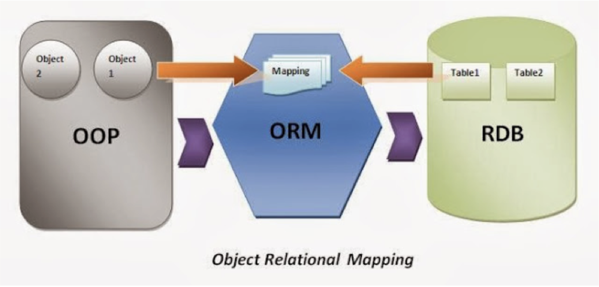

##1. ORM模型介绍

随着项目越来越大，采用写原生SQL的方式在代码中会出现大量的SQL语句，那么问题就出现了：

> 1. SQL语句重复利用率不高，越复杂的SQL语句条件越多，代码越长。会出现很多相近的SQL语句。
> 2. 很多SQL语句是在业务逻辑中拼出来的，如果有数据库需要更改，就要去修改这些逻辑，这会很容易漏掉对某些SQL语句的修改。
> 3. 写SQL时容易忽略web安全问题，给未来造成隐患。SQL注入。

````python
# sql注入
cursor = connection.cursor()

username = input("请输入用户名：")  
password = input("请输入密码：")  
  
sql = "select username,password from users where username='"+username+"' and password='"+password+"'"
    
# "select username,password from users where username='' or password = ' and password=' or '1' = '1'"
    
cursor.execute(sql)
row = cursor.fetchone()
print(row)
````


`ORM`，全称`Object Relational Mapping`，中文叫做对象关系映射，通过`ORM`我们可以通过类的方式去操作数据库，而不用再写原生的SQL语句。通过把表映射成类，把行作实例，把字段作为属性，`ORM`在执行对象操作的时候最终还是会把对应的操作转换为数据库原生语句。

> 使用`ORM`有许多优点：
>
> 1. 易用性：使用`ORM`做数据库的开发可以有效的减少重复SQL语句的概率，写出来的模型也更加直观、清晰。
> 2. 性能损耗小：`ORM`转换成底层数据库操作指令确实会有一些开销。但从实际的情况来看，这种性能损耗很少（不足5%），只要不是对性能有严苛的要求，综合考虑开发效率、代码的阅读性，带来的好处要远远大于性能损耗，而且项目越大作用越明显。
> 3. 设计灵活：可以轻松的写出复杂的查询。
> 4. 可移植性：`Django`封装了底层的数据库实现，支持多个关系数据库引擎，包括流行的`MySQL`、`PostgreSQL`和`SQLite`。可以非常轻松的切换数据库。




## 2. 创建ORM模型：

### 2.1 安装驱动

````
workon django_env
pip install mysqlclient
````

我们使用`Django`来操作`MySQL`，实际上底层还是通过`Python`来操作的。因此我们想要用`Django`来操作`MySQL`，首先还是需要安装一个驱动程序。在`Python3`中，驱动程序有多种选择。比如有`pymysql`以及`mysqlclient`等。这里我们就使用`mysqlclient`来操作。`mysqlclient`安装非常简单。只需要通过`pip install mysqlclient`即可安装。

1. > 常见`MySQL`驱动介绍：
   >
   > 1. `MySQL-python`：也就是`MySQLdb`。是对`C`语言操作`MySQL`数据库的一个简单封装。遵循了`Python DB API v2`。但是只支持`Python2`，目前还不支持`Python3`。
   > 2. `mysqlclient`：是`MySQL-python`的另外一个分支。支持`Python3`并且修复了一些`bug`。
   > 3. `pymysql`：纯`Python`实现的一个驱动。因为是纯`Python`编写的，因此执行效率不如`MySQL-python`。并且也因为是纯`Python`编写的，因此可以和`Python`代码无缝衔接。
   > 4. `MySQL Connector/Python`：`MySQL`官方推出的使用纯`Python`连接`MySQL`的驱动。因为是纯`Python`开发的。效率不高。


### 2.2 定义模型

`ORM`模型一般都是放在`app`的`models.py`文件中。每个`app`都可以拥有自己的模型。并且如果这个模型想要映射到数据库中，那么这个`app`必须要放在`settings.py`的`INSTALLED_APP`中进行安装。以下是写一个简单的书籍`ORM`模型。示例代码如下：

```python
from django.db import models
class Book(models.Model):
    name = models.CharField(max_length=20,null=False)
    author = models.CharField(max_length=20,null=False)
    price = models.FloatField(default=0)
```

以上便定义了一个模型。这个模型继承自`django.db.models.Model`，如果这个模型想要映射到数据库中，就必须继承自这个类。这个模型以后映射到数据库中，表名是模型名称的小写形式，为`book`。

在这个表中，有四个字段，一个为`name`，这个字段是保存的是书的名称，是`varchar`类型，最长不能超过20个字符，并且不能为空。第二个字段是作者名字类型，同样也是`varchar`类型，长度不能超过20个。第三个是出版时间，数据类型是`datetime`类型，默认是保存这本书籍的时间。第五个是这本书的价格，是浮点类型。

还有一个字段我们没有写，就是主键`id`，在`django`中，如果一个模型没有定义主键，那么将会自动生成一个自动增长的`int`类型的主键，并且这个主键的名字就叫做`id`。

###2.3 ORM映射到数据库

将`ORM`模型映射到数据库中，总结起来就是以下几步：

1. 在`settings.py`中，配置好`DATABASES`，做好数据库相关的配置。

   ````python
   DATABASES = {
       'default': {
           'ENGINE': 'django.db.backends.mysql',
           'NAME': 'orm_intro',
           'USER': 'root',
           'PASSWORD': 'root',
           'HOST': '127.0.0.1',
           'PORT': '3306'
       }
   }
   ````

   

2. 在`app`中的`models.py`中定义好模型，这个模型必须继承自`django.db.models`。

   ````python
   from django.db import models
   class Book(models.Model):
       name = models.CharField(max_length=20,null=False)
       author = models.CharField(max_length=20,null=False)
       pub_time = models.DateTimeField(default=datetime.now)
       price = models.FloatField(default=0)
   ````

   

3. 将这个`app`添加到`settings.py`的`INSTALLED_APP`中。

   ````python
   INSTALLED_APPS = [
       'django.contrib.admin',
       'django.contrib.auth',
       'django.contrib.contenttypes',
       'django.contrib.sessions',
       'django.contrib.messages',
       'django.contrib.staticfiles',
       'book'
   ]
   ````

   

4. 在命令行终端，进入到项目所在的路径，然后执行命令`python manage.py makemigrations`来生成迁移脚本文件。

5. 同样在命令行中，执行命令`python manage.py migrate`来将迁移脚本文件映射到数据库中。

