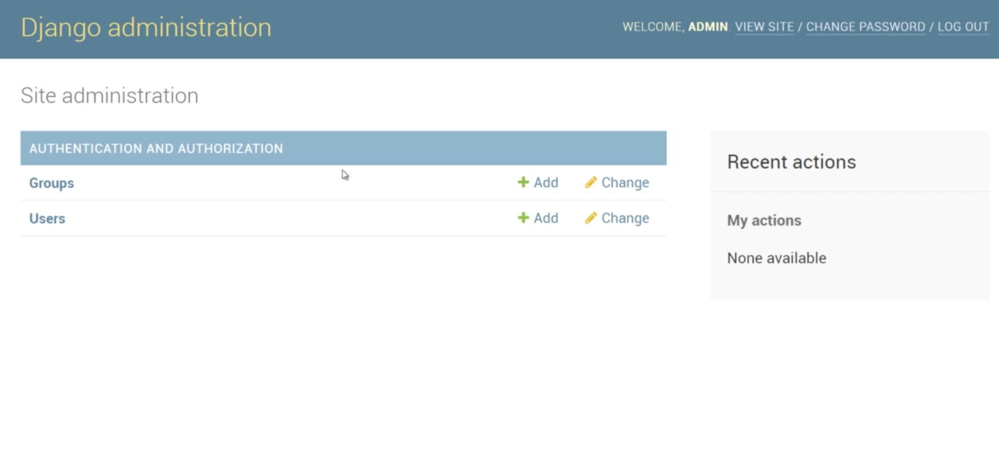
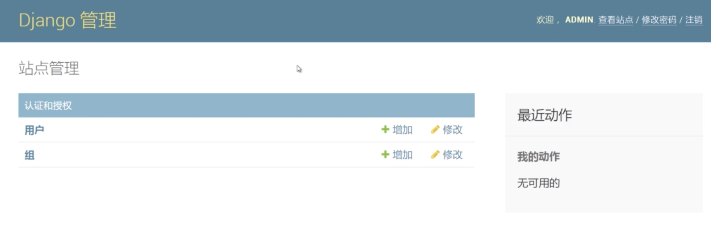
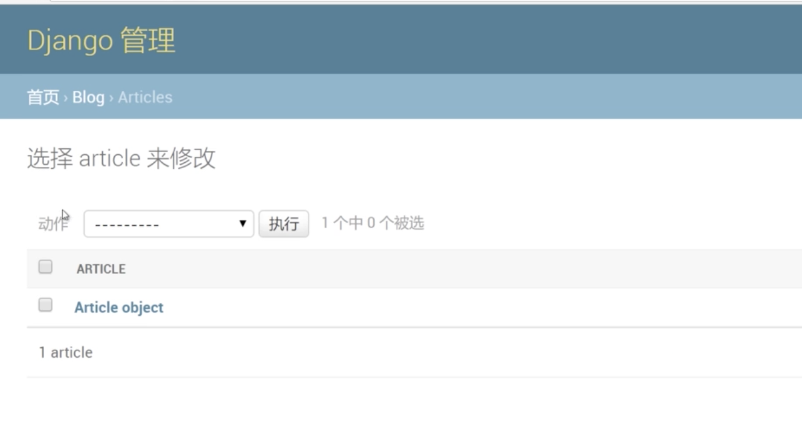
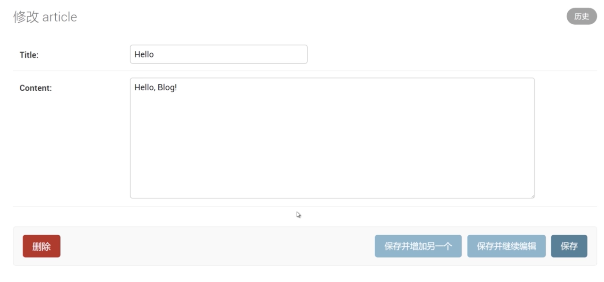

## 1. Admin简介

Admin是Django自带的一个功能强大的自动化数据库管理界面

被授权的用户可直接在Admin中管理数据库

Django提供了许多针对Admin的定制功能

## 2. 配置Admin

**创建用户:**

`python manage.py createsuperuser`创建超级用户

django从1.9版本开始对密码进行了限制, 长度不能少于8个字符, 外国人的名字以及一些简单密码做了限制.

**访问后台管理系统:**

````python
from django.contrib import admin
from django.urls import path

urlpatterns = [
    path('admin/', admin.site.urls),
]
````

通过`http:\\127.0.0.1:8000\admin\`访问Admin入口



**更改为中文:**

修改`settings.py`中的`LANGUAGE_CODE='zh_Hans'`

> 1.9版本之前可以使用zh-cn, zh-tw



**配置应用:**

在应用下`admin.py`中引入自身的`models.py`中的模型类

添加注册代码:`admin.site.register(Article)`, 其中`article`是模型类

````python
from django.contrib import admin
from a.models import Person

# Register your models here.
admin.site.register(Person)
````



##3. 使用Admin  

**修改数据:**

点击Article超链接进入Article列表页面

点击任意一条数据, 进入编辑页面修改

编辑页面下方一排按钮可执行相应的操作



## 4. 修改数据默认显示名称

**步骤:**

在Article类下添加一个方法

````python
from django.db import models


class Artilce(models.Model):
    title = models.CharField(max_length=20)
    content = models.TextField()

    def __str__(self):
        return self.name
````

## 5. 创建admin配置类

````python
from django.contrib import admin
from a.models import Person

class ArticleAdmin(admin.ModelAdmin):
	list_display('title', 'content')
    # list_display 同时支持tuple和list
    # 注意字段名field, 必须写对
	
admin.site.register(Article, ArticleAdmin)
````

过滤器: 此过滤器非彼过滤器

````python
from django.contrib import admin
from a.models import Person

class ArticleAdmin(admin.ModelAdmin):
	list_display('title', 'content')
	list_filter('title', )
    # list_display 同时支持tuple和list
    # 注意字段名field, 必须写对
	
admin.site.register(Article, ArticleAdmin)
````
