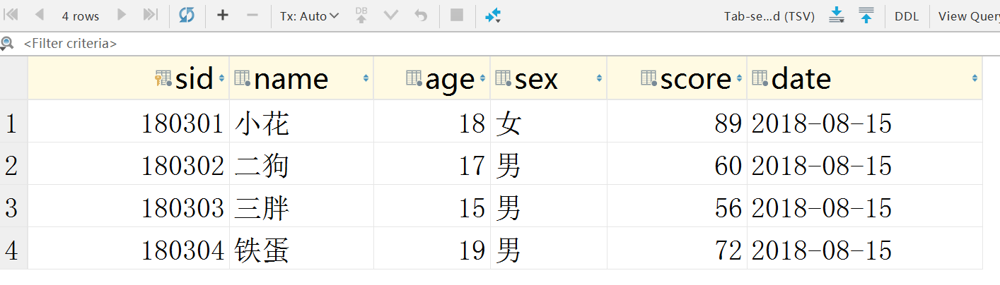

*类似于之前咱们做过的员工信息管理系统*

1. *首页可以看到所有学生的信息, 点击进入某个学生的详情界面, 点击可以修改学生信息, 在首页可以增加学生*

2. *写个视图函数, 在视图函数中向数据表中添加学生数据, 禁手动添加*

   > b = Dng.objects.create(name='二狗') 
   >
   > *或者*
   >
   > b=Dng(name='二狗')
   >
   > b.save()

3. *在详情界面可以删除学生, 删除完毕后默认跳转到首页*

4. *通过首页的增加学生按钮, 进入添加学生信息页面,可以对学生的姓名, 年龄, 性别, 成绩进行添加, 学号180309自动生成, 登记日期自动生成(为当前时间), 添加成功后显示学生的所有信息!*

5. *修改学生信息, 可以对除了学号以外的所有信息进行修改, 修改成功后自动跳转到详情页面展示修改后的信息*

#### 1. 创建app（推荐项目起名student_manager）

终端执行操作`python manage.py startapp first` 创建名为first的app

`settings.py`文件中将`first应用`进行注册

#### 2. 创建模型

`first\models.py`

> Student: 学生模型
>
> sid: 设置主键 `models.AutoField(primary_key=True) `
>
> name: 姓名`models.CharField(max_length=20) `
>
> age: 年龄`models.IntegerField() `
>
> sex: 性别`models.CharField(max_length=20) `
>
> score: 成绩`models.FloatField() `
>
> date: 登记日期`models.DateField(auto_now_add=True) ` 

>auto_now=Ture，字段保存时会自动保存当前时间，但要注意每次对其实例执行save()的时候都会将当前时间保存，也就是不能再手动给它存非当前时间的值, 并且每次修改数据都会更改时间.
>
>auto_now_add=True，字段在实例第一次保存的时候会保存当前时间，不管你在这里是否对其赋值。但是之后的save()是可以手动赋值的。也就是新实例化一个model，想手动存其他时间，就需要对该实例save()之后赋值然后再save()。

时区问题: django中默认的时区设置是格林尼治时间, 即`TIME_ZONE = 'UTC' `, 而我国所处为东八区,应更改为

```python
TIME_ZONE = 'Asia/Shanghai'
USE_TZ = False 
```

创建迁移文件`python manage.py makemigrations`

执行迁移文件`python manage.py migrate`

#### 3. 连接数据库 查看表


#### 4. 通过视图函数index添加表数据

````python
def index(request):
    Student.objects.create(sid=180301, name='小花', age=18, score=89, sex='女')
    Student.objects.create(name='二狗', age=17, score=60, sex='男')
    Student.objects.create(name='三胖', age=15, score=56, sex='男')
    Student.objects.create(name='铁蛋', age=19, score=72, sex='男')
    return HttpResponse('success')
````



#### 5. 首页功能的实现

````python
def first_page(request):
    stus = Student.objects.all()
    return render(request, 'index.html', {'stus': stus})
````


#### 6. 详情功能的实现

````python
def detail(request, sid):
    stu = Student.objects.get(sid=sid)
    return render(request, 'detail.html', {'stu': stu})
````


#### 7. 删除功能的实现

````python
def delete(request, sid):
    s = Student.objects.get(pk=sid)
    s.delete()
    return redirect('index')
````

#### 8. 修改功能的实现

````python
def update(request, sid):
    if request.method == 'GET':
        s = Student.objects.get(pk=sid)
        return render(request, 'update.html', {"stu": s})
    else:
        name = request.POST.get('name')
        age = request.POST.get('age')
        sex = request.POST.get('sex')
        score = request.POST.get('score')
        year = int(request.POST.get('year'))
        month = int(request.POST.get('month'))
        day = int(request.POST.get('day'))
        s = Student.objects.get(pk=sid)
        s.name=name
        s.age=age
        s.score=score
        s.sex=sex
        s.date=datetime.datetime(year=year, month=month, day=day)
        s.save()
        return redirect(reverse(detail, kwargs={'sid': s.sid}))
````


#### 9. 增加功能的实现

````python
def add(request):
    if request.method == 'GET':
        return render(request, 'add.html')
    else:
        name = request.POST.get('name')
        age = request.POST.get('age')
        sex = request.POST.get('sex')
        score = request.POST.get('score')
        s = Student(name=name, age=age, sex=sex, score=score)
        s.save()
        s_info = '添加成功!学生姓名:%s,\n 学生年龄:%s,\n 学生性别:%s,\n 学生成绩:%s,\n 学生入学登记日期:%s,\n 学生学号:%s\n' % (s.name, s.age, s.sex, s.score, s.date, s.sid)
        return HttpResponse(s_info)
````


#### 10. url映射

````python
from django.contrib import admin
from django.urls import path
from first import views

urlpatterns = [
    path('admin/', admin.site.urls),
    path('', views.first_page, name='index'),
    path('detail/<int:sid>/', views.detail, name='detail'),
    path('add/', views.add, name='add'),
    path('update/<int:sid>/', views.update, name='update'),
    path('del/<int:sid>/', views.delete, name='del')
]
````


