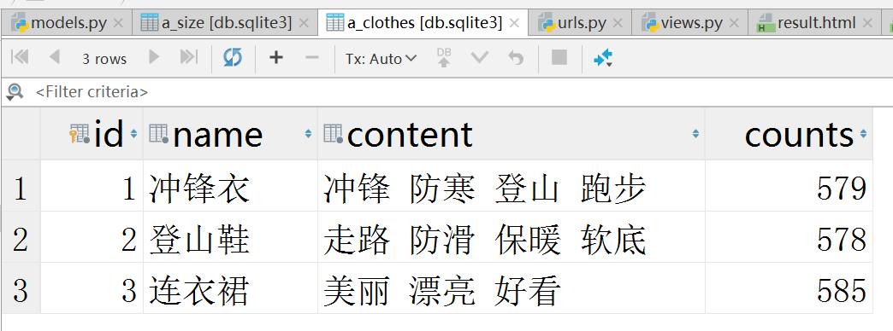
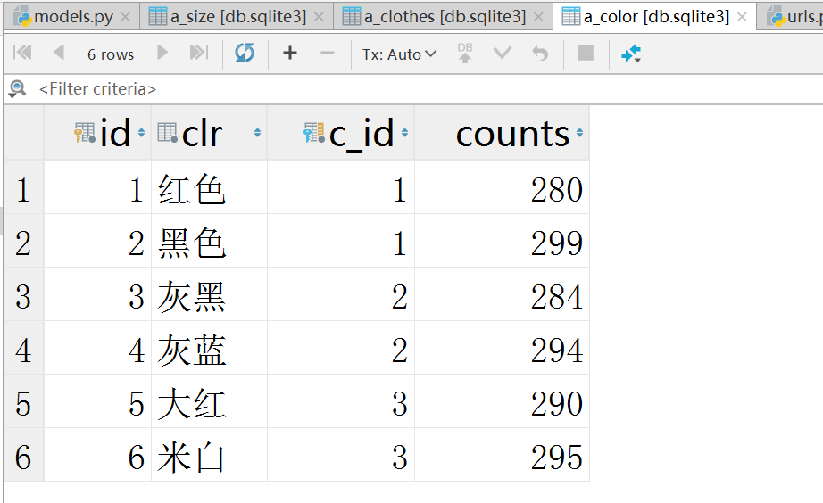
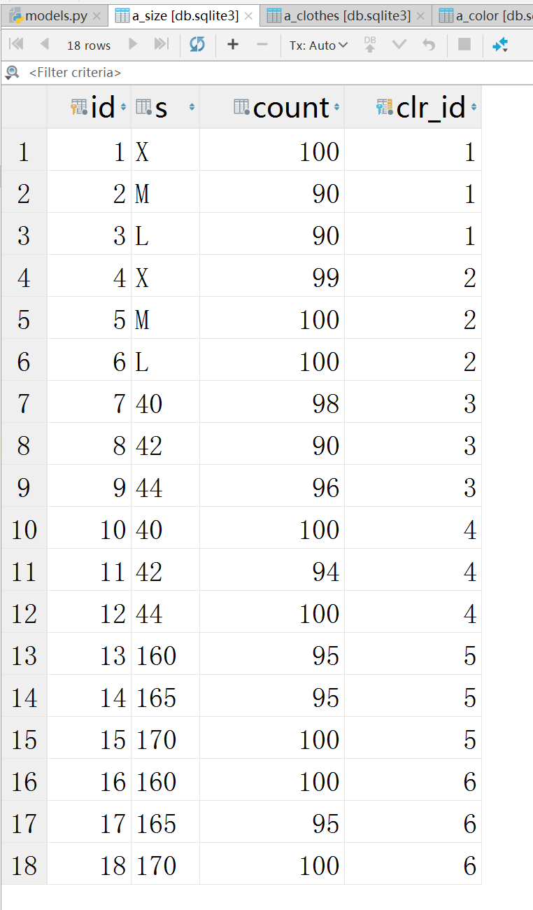

*商品库存管理系统:*

*1. 首页展示商品信息, 以及库存总量, 点击商品信息可以进入详情页面*


*2. 详情页展示商品款式和尺码信息, 以及库存总量,详情页可以记录减少库存量*


*3. 结果页面显示剩余库存信息, 可以跳转至首页*


#### 1. 创建app

终端执行操作`python manage.py startapp first` 创建名为first的app

`settings.py`文件中将`first应用`进行注册

#### 2. 创建模型

**商品:Goods** **颜色:Color** **尺码:Size**

模型关系图如下:


````python
# 商品模型
class Clothes(models.Model):
    name = models.CharField(max_length=20)
    content = models.TextField()
    counts = models.IntegerField(null=True)

# 商品款式模型
class Color(models.Model):
    clr = models.CharField(max_length=20)
    counts = models.IntegerField(null=True)
    # 商品作为外键
    c = models.ForeignKey("Clothes", on_delete=models.CASCADE)

# 商品尺码模型
class Size(models.Model):
    s = models.CharField(max_length=20)
    count = models.IntegerField()
    # 款式作为外键
    clr = models.ForeignKey('Color', on_delete=models.CASCADE)
````

创建迁移文件`python manage.py makemigrations`

执行迁移文件`python manage.py migrate`

####3. 连接数据库 


#### 4. 添加数据

##### 4.1 添加商品数据



#####4.2 添加款式数据



#####4.3 添加尺码数据



#### 5. 显示所有商品信息

````python
def index(request):
    clothes = Clothes.objects.all()
    return render(request, 'index.html', {"clos": clothes})
````


#### 6. 显示商品款式尺码详情, 并可进行库存记录

````python
def detail(request, cid):
    clrs = Color.objects.filter(c_id=cid)
    cloth = Clothes.objects.get(pk=cid)
    return render(request, 'detail.html', {"clrs": clrs, 'cloth': cloth})
````


#### 7. 提交库存记录

````python
def submit(request):
    sid_list = request.GET.getlist('sid')
    for sid in sid_list:
        count = int(request.GET.get(sid))
        sid = int(sid)
        s = Size.objects.get(pk=sid)
        s.count -= count
        s.save()

        clr = Color.objects.get(pk=s.clr_id)
        clr.counts -= count
        clr.save()

        c = Clothes.objects.get(pk=clr.c_id)
        c.counts -= count
        c.save()

    return result(request, sid_list)
````

#### 8. 显示库存记录后的结果

````python
def result(request, sid_list):
    res_list = []
    for sid in sid_list:
        sid = int(sid)
        s = Size.objects.get(pk=sid)
        clr = Color.objects.get(pk=s.clr_id)
        clth = Clothes.objects.get(pk=clr.c_id)
        res = "款式:%s     颜色:%s     尺码:%s     剩余库存:%s件" % (clth.name, clr.clr, s.s, s.count)
        res_list.append(res)
    return render(request, 'result.html', {"res": res_list})
````


#### 9. url映射

````python
urlpatterns = [
    path('admin/', admin.site.urls),
    path("", views.index, name='index'),
    path('detail/<int:cid>/', views.detail, name='detail'),
    path('result/<sid_list>/', views.result, name='result'),
    path('submit/', views.submit, name='submit'),
]
````

