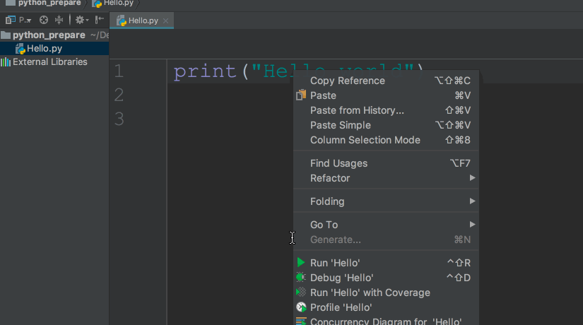

# 环境搭建以及python程序的执行

## 一、环境搭建

详见：Python开发环境的搭建.docx文档

## 二、解释执行Python代码

有3种办法运行 `python` 代码：

### 1、使用Python交互式解释器

写了python代码可以直接执行，可以进行测试，但是不能进行保存

1. 使用 python 交互式解析器`(Python Interpreter)`直接运行 python 代码

      

      

### 2、使用python运行.py文件

使用 python(window)或 python3(mac/linux)运行 `.py` 文件。

Hello.py 文件种的内容

 )

在终端，把当前目录切换到`Hello.py`所在的目录，然后输入`python3 Hello.py`

  )

### 3、使用IDE

计算机只识别机器语言或者二进制，只认识0和1，程序员所写的源文件中的代码，需要转成机器识别的二进制

> 解释器：
>
> ​	编译器： 将源文件进行编译，产生二进制文件（C,C++）
>
> ​		step1：程序员编写源文件
>
> ​		step2：编译器进行编译—>产生对应的文件
>
> ​		step3：计算机运行
>
> ​	解释器：(C#,python)
>
> ​		step1：程序员编写源文件
>
> ​		step2：解释器，逐行从上往下解释
>
> ​		step3：计算机运行
>
> python解释器：
>
> ​	编写的python源文件，xx.py 运行该程序需要逐行进行解释，然后执行
>
> 

集成开发环境（integrated development environment）

使用 IDE(例如：pycharm) 直接运行 `.py` 文件。

  

总结：

1. 使用交互式编译器好处是立即看到结果，缺点是代码没有办法保存。一般用临时测试一些代码是时候用。实际开发几乎不用
2. 使用文本编辑器编辑 `.py` 用在小型项目问题不大，但是大型项目对文件的管理就比较差。而且一般的文本编辑器代码联想和提示功能都比较弱或者没有。
3. IDE对文件的管理、代码联想功能都比较好。
