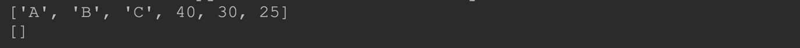
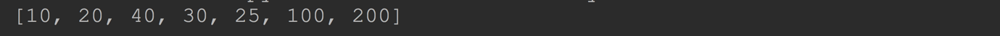

# Python 内置的数据结构

## 二、列表(list)

想一想：

> 前面学习的字符串可以用来存储一串信息，那么想一想，怎样存储咱们班所有同学的名字呢？
>
> 定义100个变量，每个变量存放一个学生的姓名可行吗？有更好的办法吗？

答：

> 列表

**列表介绍** 

` list`python 中一般把它翻译为列表.

`list` 是 python 中用途最广的一种数据结构。

`list` 可以存储多个数据，这些数据用 `[ ]` 包裹，各个数据之间用 `,` 分割。

`list`中的元素可以是任意类型的，但是实际使用的时，一个`list` 中一般只存储一种数据类型的数据。

`list` 中可以存储的元素是有顺序的，且允许重复。 

`list` 中的元素也可以更改。

`list`的索引从0开始。索引就是数据在列表中的位置编号，索引又可以被称为下标。从列表中取值时，如果超出索引范围，程序会报错

------

### 2.1    声明 `list`和使用

```python
nums = [10, 20, 40, 30, 25]
print(nums)
print(nums[0])  # 10
```


内置函数 `len` 也可以获取到 `list` 的长度

**获取列表中某一个元素的数值**

列表名[index]

​	index：表示列表中元素的下标(或者理解为位置，从0开始。到长度-1。不能越界)

### 2.2 列表的循环遍历

**使用for ...in** 

```python
for 变量名 in 列表名:
	print(变量名)  # 就是打印输出列表中的每一个元素
```

示例代码：

```python
name_list = ["张三","李四","王五","王二狗"]
for name in name_list:
    print("姓名：%s " % name)
```


**使用while循环** 

示例代码：

```python
name_list = ["张三","李四","王五","王二狗"]
index = 0
while index < len(name_list):
	print("姓名： %s " % name_list[index])
```


------

###  2.3 列表的常用操作

#### 2.3.1 列表中元素的增删改 

**修改`list` 中的元素** 

`list` 和字符串不太一样。字符串是不可变的。 而`list` 是可变的。

我们可以通过索引去更改指定索引位置的元素的值

```python
nums1 = [10, 20, 40, 30, 25]
nums1[2] = 200
print(nums1)
```


**向 `list`中添加元素和从 `list` 中删除元素**

`list.append(value)` 向 `list` 的末尾添加元素

`list.pop([index])` 把指定索引位置的元素删除. 如果不传入参数就是删除最后一个元素

`list.insert(index, ele)` 把元素 `ele` 插入到指定的 `index` 位置。原来的元素会自动右移动

```python
nums1 = [10, 20, 40, 30, 25]
nums1.append(1000)
print(nums1)
nums1.pop(0)
print(nums1)
nums1.insert(2, 2000)
print(nums1)
```


还有一种删除元素的办法:使用 `del` 运算符

> `del`关键字本质上是用来将一个变量从内存中删除的。
>
> 

```python
nums1 = [10, 20, 40, 30, 25]
del nums1[0]
print(nums1)
del nums1[0:2]
print(nums1)
```


------

通过切片也可以修改 `list` 中的元素，甚至清空 `list`

```python
nums1 = [10, 20, 40, 30, 25]
nums1[:2] = ["A", "B", "C"]     # 下标0、1的元素用 ["A", "B", "C"] 去替换
print(nums1)
nums1[:] = []   # clear list
print(nums1)
```



**extend**  

通过extend可以将另一个集合中的元素逐一添加到列表中

```python
a = [1, 2]
b = [3, 4]
a.append(b)  # [1, 2, [3, 4]]
a.extend(b)  # [1, 2, [3, 4], 3, 4]
```

> 面试题：+= 对于列表的作用
>
> 针对于列表：a += b。不是做相加再赋值的操作。本质就是a.extend(b)

------

#### 2.3.2    连接 `list`

​    `list` 可以像字符串那样通过 `+` 连接。得到的新的 `list` 包含了参与运算的两个 `list` 中所有元素

```python
nums1 = [10, 20, 40, 30, 25]
nums2 = [100, 200]
num12 = nums1 + nums2
print(num12)
```




​    

#### 2.3.3    使用索引和切片

和字符串一样，`list` 也支持索引读取和切片。**其实内置的序列类型都支持这样的操作**

```python
nums = [10, 20, 40, 30, 25]
print(nums[1])
print(nums[-3])
print(nums[:3])
print(nums[1:])
```


**注意:**

​    所有的切片操作都是返回一个新的 `list` ,所以我们可以通过切片非常轻松的 copy 一个`list`

```python
nums = [10, 20, 40, 30, 25]
new_nums = nums[:]    #    复制 list nums
print(new_nums)
```


**注意:**
这里的复制是浅复制.  其实以后你会发现在, 几乎所有的复制都是浅复制, 如果要深复制, 需要自己递归实现.

#### 2.3.4    支持`in`和`not in`

```python
nums1 = [10, 20, 40, 30, 25]
print(20 in nums1)    #    True
print(20 not in nums1)    #    False  
```

------

### 2.4 嵌套(`nested`)的`list`

嵌套的意思是，列表中的元素也可以是列表。

因为列表中的元素可以是任意类型，所以嵌套也是很容易理解的。

```python
nums = [[1, 2], [3, 4], [20, 10]]
print(nums)

print(nums[0][0])
print(nums[1][1])
```


------

### 2.5 列表推导(List Comprehensions)

列表推导，有人也叫列表包含。

他提供了一种更加简洁的方式去创建列表。

**列表推导的语法:**

```python
[表达式 for item in 序列]
```

说明:

会对序列中的每个 item 执行表达式, 然后把值存入到一个新的列表中.


举个例子，要生成list [1, 2, 3, 4, 5, 6, 7, 8, 9, 10]可以用list(range(1, 11))：

示例代码1：

```python
nums = list(range(1, 11))
print(nums)  # [1, 2, 3, 4, 5, 6, 7, 8, 9, 10]
```


示例代码2：求一个数的3次方

```python
nums = [x**3 for x in range(10)]
print(nums)
```


上面的代码相当于:

```python
nums = []
for x in range(10):
    nums.append(x ** 3)
```

示例代码3：

列表推导的时候也可以添加条件：求偶数的平方

```python
nums = [x ** 2 for x in range(20) if x % 2 == 0]
print(nums)
```


列表推导也支持`for 的嵌套`

示例代码4：

```python
s1 = ["a", "b", "c"]
s2 = [20, 30]

s3 = [x + str(y) for x in s1 for y in s2]
print(s3)
```


**注意:**

得到的列表的长度是一种笛卡尔积.  也就是说新列表的长度是原列表的长度的乘积.

------

### 2.6 总结

通过以上的学习，我们可以看到`str`和`list`有许多通用的特点：都支持索引和切片

由于字符串是不可变对象，所以字符串没有删除的操作。`list`是可变的，所以提供了删除的操作。

| 序号   | 分类   | 关键字/函数/方法             | 说明           |
| ---- | ---- | --------------------- | ------------ |
| 01   | 增加   | 列表.insert(索引，数据)      | 在指定位置插入数据    |
|      |      | 列表.append(数据)         | 在末尾追加数据      |
|      |      | 列表.extend(列表2)        | 将列表2的数据追加到列表 |
| 02   | 修改   | 列表[索引] = 新值           | 修改指定索引的数据    |
| 03   | 删除   | del 列表[索引]            | 删除指定索引的数据    |
|      |      | 列表.remove[数据]         | 删除第一个出现的指定数据 |
|      |      | 列表.pop                | 删除末尾数据       |
|      |      | 列表.pop(索引)            | 删除指定索引数据     |
|      |      | 列表.clear              | 清空列表         |
| 04   | 统计   | len(列表)               | 列表长度         |
|      |      | 列表.count(数据)          | 数据在列表中出现的次数  |
| 05   | 排序   | 列表.sort()             | 升序排序         |
|      |      | 列表.sort(reverse=True) | 降序排序         |
|      |      | 列表.reverse()          | 逆序，反转        |
| 06   | 切片   | 列表[start:end]         |              |


