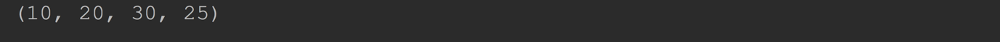

#Python 内置的数据结构

## 三、元组(tuple)

python 作为一个发展中的语言，也提供了其他的一些数据类型。

`tuple`也是 python 中一个标准的序列类型。

他的一些操作和`str`和`list`是通用的，因为他们都是一种序列(`sequence data type`)

支持索引、切片、连接，支持使用内置`len()`来获取`tuple`中元素的个数。

另外`tuple`是不可变对象，所以不能对`tuple`做修改。

> 元组与列表相似，不同之处在于元组的元素不能修改	

### 3.1 元组的创建

元组使用()定义，用于存储一串信息，使用`comma(逗号)`隔开的多个值就组成了`tuple`

索引从0开始。(索引就是数据在元组中的位置编号)

```python
t = 10, 20, 30, 25  # 创建了一个 tuple 并把这个 tuple 赋值给变量 t
print(t)
```



注意：`tuple` 在输出的时候总是用一对圆括号包裹起来

------

如果`tuple`中只有一个元素，这个时候书写的时候容器与普通的变量混淆，所以，python 要求在第一个元素的后面必须添加一个 `comma`

```python
t2 = 10,
print(t2)
```


------

前面的这种`tuple`写法可读性不好，所以在实际使用的时候会直接把`tuple`用圆括号括起来，就像他在终端的输出的那样。

```python
t1 = (10, 20, 30, 25)
print(t1)
t2 = (10,)
print(t2)
```

------

如圆括号中不添加任何元素则就是一个空的`tuple`。

直接调用`tuple()`也可以得到一个空的`tuple`。

```python
t1 = ()  # 1个空的 tuple
print(t1)

t2 = tuple()
print(t2)  # 1个空的 tuple
```


------

`tuple`也支持嵌套

```python
v = ([1, 2, 3], [3, 2, 1], (2, 3))
print(v)
```


------

使用内置函数`len()`获取`tuple`的长度

```python
v = (10, 20, 30, 40)
print(len(v))    # 4
v = ([1, 2, 3], [3, 2, 1], (2, 3))
print(len(v))    # 3
```


### 3.2 元组的索引和切片

`tuple`和`list`一样都属于序列，`list`的大部分操作都能支持操作`tuple`,除了修改和删除操作。

```python
v = (10, 20, 30, 40)
print(v[0])
print(v[1:3])
```


```python
v = (10, 20, 30, 40)
v[1] = 100    # 抛出异常
```


