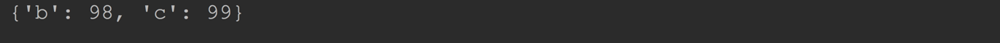

# Python 内置的数据结构

## 四、字典(dict)

字典也是 python 提供给我们的又一个非常重要且有用的数据结构。

字典在别的语言中有时叫关联数组、关联内存、Map等。

字典中存储的是一系列的`key-value`,这些`key-value`称之为键值对。

字典与前面学习的序列不同，序列通过`index`来索引数据，而字典则是通过`key`来索引`value`。

最好把字典认为是一系列无序键值对的集合。

> 序列(list)：使用[]定义
>
> 元组(tuple)：使用()定义
>
> 字典(dict)：使用{}定义

键(key)是索引

值(value)是数据

键和值之间使用:分隔

键必须是唯一的

值可以是任意数据类型。但键只能使用字符串，数字或元组

### 5.1 字典的创建

#### 4.1.1通过字面量形式创建

把这些键值对用`comma(逗号)`隔开，再把这些键值对封装在一对`brace(大括号)`中。 键与值之间用冒号隔开。

```python
tels = {
    "ls": 1604,
    "zs": 1000,
    "ww": 2000
}

print(tels)
```


------

如果在 `{}` 中不添加任何的键值对，则创建了一个空的字典。如果把它当布尔值来用的话，就是表示 `False`

```python
d = {}
print(d)    # {}
```

------

#### 4.1.2 使用`dict()` 构造器创建

使用 `dict()` 构造器传入键值对序列创建出字典

```python
d = dict([['space',4139],('guido',4127),('jack',4098)])
print(d)
#c = dict([('space',100),('guido',200),('jack',300)])
#print(c)
```


使用关键字参数创建

如果字典的`key`是简单的字符串的时候，通过关键字参数也可以方便的创建字典

```python
d = dict(sape=4139, guido=4127, jack=4098)
print(d)
```


------

#### 4.1.3 通过字典推导创建字典(类似列表推导)

```python
# key是3-9的数字，value 是他的3次方
d = {x: x ** 3 for x in range(3, 10)}
print(d)
```


### 4.2 字典中键和值

并不是所有的类型的数据都可以做`dict`的`key`，`key`必须是不可变`(immutable)`类型。

`value`没有类型限制。

`key`不允许重复。

数字和字符串经常用做`key`，`tuple`中如果存储的是数字、字符串或`tuple` 也可以做为`key`.

`list`是可变的，不能作为`key`, 如果`tuple`直接或者间接的包含了可变类型，也不能做为`key`。

```python
d = {
    [10]: "abc"    # list 不能作为 key
}
```


------

```python
d = {
    (10, 20), "hello"    # tuple 可以作为 key
}
```


------

```python
d = {
    ([10], [20]): "hello" # tuple 存储有可变类型，也不能做 key
}
```


### 4.3 字典的常用操作

字典的主要操作就是储存键值对、根据指定的`key`获取对应的`value`、删除键值对。

#### 4.3.1 向字典中添加键值对

使用 `字典名[键] = 值`的方式去添加

```python
d = {"a": 97}

d["b"] = 98 #向 dict中添加新的键值对  "b"就是键, 98就是值
d["c"] = 99
print(d)
```


如果添加的时候`key`已经存在了，则会用的新的值覆盖旧的值。

```python
d = {"a": 97}
d["a"] = 970
print(d)
```


------

#### 4.3.2 判断`key`是否在`dict`中存在

使用`in`或`not in`来判断。

```python
d = {"ac": 98, "ab": 99, "c": 97}

print("ac" in d)
print("d" not in d)
```


------

#### 4.3.3 根据`key`获取`value`

直接使用`字典名[键]`的方式获取

```python
d = {"a": 97}
print(d["a"])    # 97
```

如果访问不存在的`key`则会抛出异常。

```python
d = {"ac": 98, "ab": 99, "c": 97}
print(d["aa"])
```


如果避免抛出异常，一般有 2 种方式：

1. 先用 `in` 判断

```python
d = {"ac": 98, "ab": 99, "c": 97}
if "aa" in d:
    print(d["aa"])
```

1. 使用字典的实例方法`get(key)`来访问

```python
d = {"ac": 98, "ab": 99, "c": 97}
print(d.get("aa"))
print(d.get("aa", "随机给你的"))
print(d.get("ac", "随机给你的"))
```


#### 4.3.4 删除`key-value`

使用关键字`del`可以删除指定`key`的`key-value`对。

```python
d = {"a": 97, "b": 98, "c": 99}
del d["a"]

print(d)
```




#### 4.3.5 获取所有的`key`

通过`list(dict.keys())`可以获取在字典中所有的`key`组成的`list`,这些 key 的顺序是随机的。

```python
d = {"a": 98, "b": 99, "c": 97}

list1 = list(d.keys())
print(list1)
```


如果想获取排好序的`key`可以会用`sorted(dict.keys())`

```python
d = {"ac": 98, "ab": 99, "c": 97}

list1 = sorted(d.keys())
print(list1)
```


------

#### 4.3.6 获取所有的 value

通过`list(dict.values())`可以获取在字典中所有的 value 组成的`list`,这些 value 的顺序是随机的。

```python
d = {"a": 98, "b": 99, "c": 97}

list1 = list(d.values())
print(list1)
```


------

如果想获取排好序的`key`可以会用`sorted(dict.keys())`

```python
d = {"ac": 98, "ab": 99, "c": 97}

list1 = sorted(d.keys())
print(list1)
```


