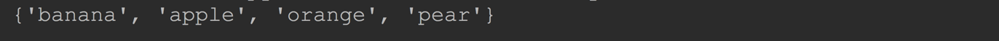
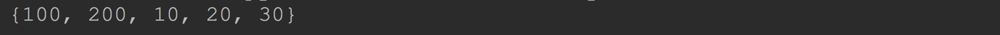
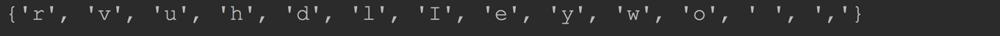
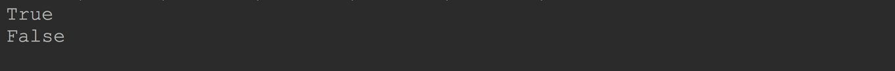
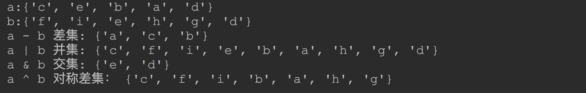
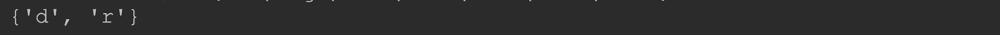
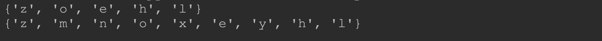

我 4 # Python内置数据结构

## 五、集合(set)

python 还提供了另外一种数据类型：`set`。

`set`用于包含一组无序的不重复对象。所以`set`中的元素有点像`dict`的`key`。这是`set`与 `list`的最大区别

`set`基本应用有元素测试、去除`list、tuple`中的重复元素。

`set`也支持一些数学操作,像：并集(`union`)、交集(`intersection`)、差集(`difference`)、对称差集(`symmetric difference`)。


`set`集合创建方式一般有 2 种：字面量方式和把`list、tuple、str`等转换成`set`


### 5.1 set集合的创建

#### 5.1.1 字面量方式创建`set`集合

字面量方式创建`set`集合和字面量`dict`有点像，都是使用的`{}`来包裹, 只不过`set`中不是键值对而已。

```python
basket = {'apple', 'orange', 'apple', 'pear', 'orange', 'banana'}

print(basket)
```

**`set`中不能存储重复元素**



------

#### 5.1.2 把`list`中的元素存入到`set`

使用`set`构造函数支持把`list`中的元素直接存入到新创建的`set`中。

```python
nums1 = [10, 20, 30, 20, 10, 100, 200, 100]
nums2 = set(nums1)
print(nums2)
```



重复元素也去除成功了！


#### 5.1.3 把字符串中的每个字符作为一个元素存入到`set`

```python
s = "hello world, I love you"
cs = set(s)
print(cs)
```



你会发现重复字符已经去除完毕了。


注意：

创建空的`set`不能直接使用字面量的形式`{}`，这样创建的是空的字典。只能使用`set`构造函数。

```python
s = {}
print(type(s) is dict)

s = set()
print(type(s) is dict)
```




### 5.2 set常用操作

#### 5.2.1支持`in`和`not in`

```python
nums1 = {10, 20, 30, 20, 10, 100, 200, 100}
print(10 in nums1)    # True
print(20 not in nums1)    # False
```


#### 5.2.2 数学操作

`set`也支持一些数学操作,像：并集(`union`)、交集(`intersection`)、差集(`difference`)、对称差集(`symmetric difference`)。

```python
a = set("abcde")
b = set("defghi")
print("a:" + str(a))
print("b:" + str(b))

print("a - b 差集: " + str(a - b))  # 差集   a 中有，但是 b 中没有
print("a | b 并集: " + str(a | b))  # 并集   a 和 b 的元素全部都有 当然不会重复
print("a & b 交集: " + str(a & b))  # 交集   a 和 b 共同有的元素
print("a ^ b 对称差集： " + str(a ^ b))  # 对称差集   a 有或者 b 有，但是不是他们都有
```



#### 5.2.3 `set`推导

同`list`推导一样，`set`也支持`set`推导

```python
a = {x for x in 'abracadabra' if x not in 'abc'}
print(a)
```



#### 5.2.4 在集合中添加新项

```python
s = set("hello")

s.add("z")  # 添加一项
print(s)

s.update(["x", "y"])    # 添加多项
s.update("mn")  # 添加多项
print(s)
```




