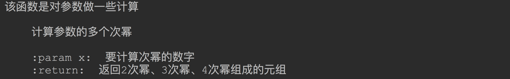

# 函数

为了便于程序的维护和更好的实现模块化，好的程序都会分解为很多函数。

可以这么说，对于任何的编程语言，函数都是一个非常重要的概念。

python 不仅简化了函数的定义过程，而且还大量借鉴了其他函数编程语言中的优秀特性。

**本章内容非常重要！**


## 一、 函数的概念和作用

### 1.1什么是函数

函数就是把完成特定功能的一段代码封装起来。给该功能起一个名字（函数名）。

哪里需要实现该功能就在哪里调用该函数。

函数可以在任何时间任何地方调用。

> 所谓函数，就是把具有独立功能的代码块组织为一个小模块，在需要的时候调用。

### 1.2 函数的作用

- 函数是能完成某一功能的代码段
- 函数是可重复执行的代码段
- 函数方便管理和维护,便于复用

## 二、函数的使用

### 2.1 函数的使用步骤

1. 定义函数：封装独立的功能
2. 调用函数：就是执行函数。(调用几次就函数执行几次)

### 2.2 函数的定义

使用函数之前一定要先定义。

python 的函数定义非常简单。

函数定义语法：

```python
def 函数名([形参列表]):
    函数体
```

说明：  

1. `def` 是定义函数的关键字。\(define function\)

2. 函数名是这个函数的符号\(引用\)，调用这个函数的时候我们需要函数名。

3. 函数名后的圆括号是必须的。

4. 形参列表表示我们可以定义多个形参，接受函数调用时传递过来的参数。形参不是必须的，根据需要决定是否需要定义形参

5. 圆括号后面必须有一个冒号`:`.

6. 新起一行，必须有缩进来定义函数体。函数体就是函数每次调用的时候都会执行的代码。

   示例代码：

```python
# 定义无参函数
def show():
    print("我是函数内的代码1")
    print("我是函数内的代码2")


# 定义有参函数，形参在函数内部可以作为普通变量使用。
def show1(a, b):
    print(a + b)
```

> 定义函数名称的规则：
>
> 1. 可以由字母，下划线，和数字组成
> 2. 数字不能开头
> 3. 不能与关键字重名
> 4. 多个单词小写使用下划线拼接：get_sum

### 2.3 函数的调用

定义函数的目的是为了让函数做一些事情。

但是函数如果仅仅定义不会自己去执行。

**时刻记住一句话，函数只有被调用才能被执行！**

所以想要函数执行，必须显示的去调用函数。

**在使用函数的时候，一定要保证声明在前，调用在后！**

#### 2.3.1 简单函数调用

函数调用非常简单，只需要： `函数名(实参)`即可。当然如果函数定义的时候没有形参，则就不用实参。

```python
def show():
    print("我是函数内的代码1")
    print("我是函数内的代码2")


show()    # 调用函数
show()    # 一个函数可以多次调用。每次调用都会执行一次函数体的代码
show()
```


------

#### 2.3.2 带形参的函数调用

函数声明的时候，在括号内的是形参。

那么在调用函数的时候应该传递相同属性的参数过去，函数调用的时候的参数，叫做实参！

形参和实参的个数必须匹配，但是有一种情况除外，后面再说。

```python
def add(a, b):
    print(a + b)

add(2, 3)
add(20, 3)
```


### 2.4函数的返回值

我们定义的函数可以完成一个的功能，很多情况下，功能完成之后需要给函数调用者返回一些数据，这些返回的数据就需要用到函数的返回值功能。

> 返回值就是函数执行完毕后返回给调用处的结果

#### 2.4.1.`return`的使用

比如：定义一个函数可以实现两个数的相加，然后返回给调用者计算的结果！

```python
def add(a, b):
    pass
    n = a + b
    return n

print(add(3, 5))
print(add(30, 5))
```


说明：

1. 在函数内任何地方都可以出现`return`。`return`的作用就是结束函数，并把`return`后面的值返回给调用者。

2. 一旦碰到 `return`,不管后面有多少代码，不管是否处于循环中，函数都会立即结束。

3. 如果整个函数内部没有出现`return`,则函数会自动执行到函数体最后一行代码。

4. 如果函数体内没有`return`,则函数运行结束的时候自动返回`None`

5. `return`后面也可以不跟返回值，这种情况下主要是为了结束函数，也会返回`None`  (return None可以简写为return。)

   

   ​

**案例1：一个给定的数，判断是否为质数**

分析：定义一个函数，这个给定的数通过参数传递，最后结果：是否为质数，通过返回一个`bool`值给调用者。*质数*（prime number）又称素数，有无限个。*质数定义*为在大于1的自然数中，除了1和它本身以外不再有其他因数。 

```python
def is_prime(num):
    for i in range(2, num):
        if num % i == 0:
            return False

    return True


num = int(input("请输入一个整数："))
if is_prime(num):
    print("%d 是质数！" % num)
else:
    print("%d 不是质数！" % num)
```


**案例2：计算输入的任意两个数之间所有的质数的和**

分析：刚才已经定义了判断一个是否为质数，现在需要再定义一个可以计算两个数之间所有的质数的和的函数，并把计算结果返回给调用者。

```python
def is_prime(num):
    for i in range(2, num):
        if num % i == 0:
            return False

    return True


def add_prime(num1, num2):
    sum = 0
    for num in range(num1, num2+1):
        if is_prime(num):
            sum += num

    return sum


num1 = int(input("请输入第一个整数："))
num2 = int(input("请输入第2个整数："))
print("%d 到 %d 的之间所有的质数的和是：%d" % (num1, num2, add_prime(num1, num2)))
```

#### 2.4.2.返回多个值

使用`return`一次只能返回一个值。

有些场景下，我们需要返回多个值。这种情况下我们我们可以把返回值的封装到`list`或`tuple`中，接受者拿到这个`list`或`tuple`直接解包就可以使用了。

最好封装在`tuple`中，因为`tuple`是不可变的, 所以效率比较高。

```python
def foo(x):
    return x ** 2, x ** 3, x ** 4

x = 4
a, b, c = foo(x)

print("%d 的平方是：%d, 3次方式：%d, 4次方是：%d" % (x, a, b, c))
```


### 2.5 文档注释

以前我们使用 `#` 来我们的代码添加注释，只使用单行注释。

我们定义了一个好函数，函数的描述等信息也应该让调用者很容易获取到，这个时候就用到文档注释。

文档注释将来可以直接生成 `api` 文档方便阅读。

如果要给函数添加文档注释，直接在函数内部的首行放置一个字符串即可。字符串可以是单行的(`"  "或者'  '`)，也可以是是多行的(`"""    """ 或 '''         '''`)。

**但是一般使用多行字符串来定义**

作为国际惯例：

1. 注释的第一行，一般是对函数的简述。
2. 然后一个空行。
3. 然后开始进行详细描述函数功能等。

```python
def foo(x):
    """该函数是对参数做一些计算
    
    计算参数的多个次幂
    
    :param x:  要计算次幂的数字
    :return:  返回2次幂、3次幂、4次幂组成的元组
    """
    return x ** 2, x ** 3, x ** 4

print(foo.__doc__)  # 打印函数的文档注释
```




