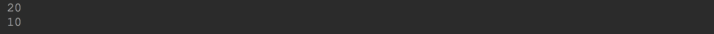
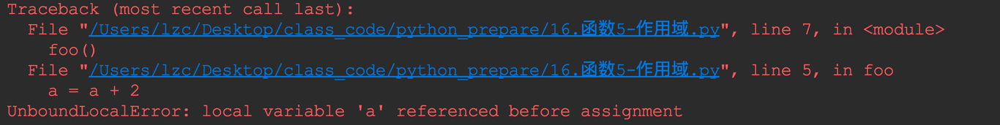
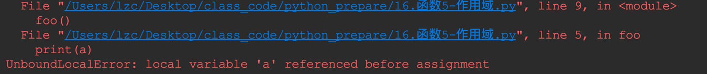
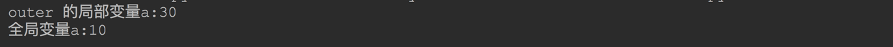

# 函数

## 三、作用域规则

有了函数之后，我们必须要面对一个作用域的问题。

比如：你现在访问一个变量，那么 python 解析器是怎么查找到这个变量，并读取到这个变量的值的呢？ 依靠的就是作用域规则！

### 3.1 作用域

作用域(`scope`)

作用域就是 python 程序的一块文本区域，在这个区域内，可以直接访问(Directly accessible)命名空间。

直接访问的意思就是：当你访问一个绝对的命名的时候，直接在命名空间中查找

尽管作用域的定义是静态的，但是作用域的使用(查找变量)却是动态的。

------

在代码执行的任何时间，至少有 3 个嵌套的作用域，这些作用域的命名空间可以直接访问。

1. 内部作用域(局部作用域)。包含了所有的局部命名，在访问变量的时候，首先在内部作用域中查找。
2. 然后是嵌套函数的外层作用域。在这里搜索非局部，但也是非全局的命名。(在 python 中允许在函数中定义函数的)
3. 然后是包含当前模块的全局作用域。
4. 最后搜索的是最外层的创建内置命名的作用域。

------


> ### 作用域搜索规则：LEGB
>
> L:局部的（local）
>
> E：封闭的（Enclosing）
>
> G：全局的（Global）
>
> B：内置的（Built-in）
>
> #### 一、局部命名空间
>
> 函数内部的命名空间，在调用函数的时候生成，调用结束时消失。当局部命名空间有效时，它是第一个用于检查某个名字存在性的命名空间。如果在局部命名空间内找到该名称，则返回与名字相关联的对象，反之提示出错。

### 3.2作用域在 python 中的具体应用

#### 3.2.1.访问局部作用域

```python
def foo():
    a = 20
    print(a)

foo()
```

说明：

函数内部访问变量`a`, 先在`foo`函数内部查找。因为 `a`确实是在函数内部声明的变量，然后就找到了`a`

------

#### 3.2.2.访问外部作用域

```python
a = 100


def foo():
    print(a)


foo()
```

说明：

1. 在`foo`函数内部，我们直接去访问一个变量 `a`,那么就会沿着作用域从内向外开始查找`a`
2. 先查找`foo`的局部作用域，发现没有`a`。然后继续去`foo`函数的外部作用域，这个例子中就直接到了当前模块的全局作用域，所以找到了 a, 所以就输出了全局作用域中`a`的值！

------

#### 3.2.3.访问外部函数的作用域

```python
def outer():
    a = 20

    def inner():
        print(a)

    inner()


outer()
```

说明：

1. 我们在一个函数的内部声明了一函数，这种函数嵌套在 python 中是允许的。
2. 内部函数`inner`执行的时候，访问变量`a`,现在`inner`内部找变量`a`, 没有找到，然后去他外部的函数中找变量`a`, 找到后, 就直接输出了他的值

------


#### 3.2.4 python 针对修改变量值的特殊情况

##### 3.2.4.1.只能修改局部变量

**在 python 的函数中, 修改一个变量的值的时候,永远操作的是局部变量**

为什么会这样呢? 

这其实是由 python 定义变量的方式所决定的. 

python 不需要显示的去定义变量,直接赋值的时候如果变量不存在直接就定义了. 

如果在函数内部可以直接修改外部作用域变量的值,则就无法定义一个同名变量了.

所以, python 才规定不能在函数内部直接修改外部作用域变量的值.

------

```python
a = 10


def foo():
    a = 20 # 这里其实是新创建了一个局部变量 a .并不是修改的全局作用域的变量 a

    print(a) # 根据作用域的查找规则,这里访问的是局部变量 a


foo()
print(a) # 根据作用域查找规则,这里访问的是全局作用域的 a
```



------

##### 3.2.4.2.变量必须先赋值才能使用

看下面的代码:

```python
a = 10


def foo():
    a = a + 2

foo()
```



**说明:**

`a = a + 2` 这行代码有问题. 为什么?

首先要搞清楚 `a + 2` 中的`a`是局部变量还是全局变量?

**是局部变量`a`!**

在解释器运行这个函数的时候, 已经检测到函数内部有创建局部变量`a`, 所以这个时候你访问到的一定是局部变量`a`. 

`a + 2` 中的局部变量`a`还没有 被赋值,所以和 2 相加抛出了异常.`UnboundLocalError`（局部变量错误）

------

```python
a = 10


def foo():
    print(a)
    a = 20


foo()
```



说明:
原因和前面的一样的.

解析器已经检测到你后面会声明局部变量`a`, 所以`print(a)`中的 `a` 仍然是局部变量.但是还没有赋值,所以就抛异常了

------

**总结:**

在函数内部如果你定义了局部变量,那么你在任何地方都没有办法访问到函数外部作用域的同名变量.

------

##### 3.2.4.3 函数内修改全局变量

通过前面的学习, 正常情况下我们知道了在函数内部没有办法修改全局变量的值! 

**但是这只是正常情况下!**

如果我们有在函数内部修改全局变量值的需求怎么办?

**_也是可以的, 但是我们需要做些小动作: 使用关键字`global`_**

------

```python
a = 10

def foo():
    global a    # 告诉 python 解析器, a 以后就是全局变量了
    a = 20

foo()

print(a)    # 20
```

**说明:**

1. `global` 后面跟上全局变量的名, 那么在后面的代码中就可以使用全局变量了.
2. 如果有多个全局变量需要修改, `global`可以同时定义多个全局变量.`global a, b, c`

------


##### 3.2.4.4内部函数修改外部函数的局部变量

当用到函数嵌套的时候, 内部函数正常情况下也是无法修改外部函数的局部变量, 只能访问读取.

如果想修改怎么办? 

使用关键字:`nonlocal`

```python
a = 10


def outer():
    a = 20

    def inner():
        nonlocal a  # 把 a 绑定到外部函数的局部变量 a 上
        a = 30

    inner()

    print("outer 的局部变量a:" + str(a))  # 30 被内部函数 inner 修改了


outer()
#print("全局变量a:%d"%a)
#print("全局变量a:",a)
print("全局变量a:" + str(a))
```



