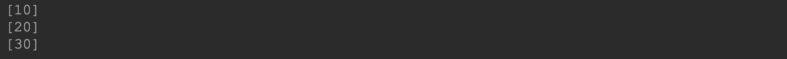
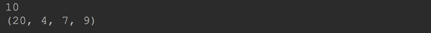
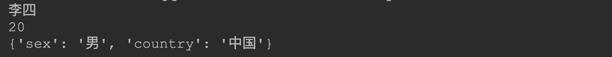

# 函数

## 四、参数

### 4.1 默认值参数(也叫缺省参数)

#### 4.1.1 默认值参数基本使用

定义函数的时候, 如果个别参数不需要调用者必须传递实参过来, 则可以使用参数默认值.

当调用函数的时候, 带有默认值的参数可以不传递实参过来, 这样 python 就会使用这个参数的默认值.

如果带有默认值的参数也被传递了实参过来, 则使用调用者传递过来的具体的值, 不再使用默认值.

```python
def add(x, y=20):   # 给 y 添加了默认值
    return x + y

print(add(100, 200)) # 给 y 传递了实参, 则不会使用默认值

print(add(100))    # 没有给 y 传递实参, 则使用 y 的默认值
```


**使用参数默认值的好处: 使用较少的参数去调用函数**

#### 4.1.2默认值赋值时机

参数的默认值, 可以是字面量, 也可以用 **函数** 赋值.

那么参数的默认值是在什么时候赋值的?

**python 的默认值是在函数定义的时候已经赋值完成了!  你可以理解为这是静态赋值!** 

这个和其他语言有点不用:比如 javascript 是在每次调用的时候才赋值.

```python
i = 10


def add(x, y=i):    # 函数定义的时候 y 的值已经被赋值为10
    return x + y


i = 20    # 这里更改 i 的值不会更改参数 y 的默认值

print(add(10))    # 20
```

**参数的默认值也可以是函数**

```python
i = 10


def get_value():
    global i
    i += 10
    return i


def add(x, y=get_value()):    # y=20
    return x + y


i = 20

print(add(10))    # 30
print(add(10))    # 30
```

------

#### 4.1.3 带有默认值参数后的参数处理

**python 规定, 带有默认的参数的后面的所有参数都是可选的** 

意思就是说,这些参数也应该加上默认值, 否则语法错误!

下面这种定义方式是错误的

```python
def add(x, y = 10, z):    # 错误.  z 必须也有默认值
    pass
```


------

**后面的参数不能以前面的参数作为默认值**

python 不允许后面的参数把前面的参数作为默认值. (javascript 允许)

```python
def add(x, y = 10, z = y):
    pass
```


------

#### 4.1.4 默认值是可变对象时的共享问题

由于默认值是在函数定义的时候就赋值成功了.

对可变参数来说, 多次调用这个函数, 那么每次调用都是共享的同一个对象.

如果函数执行的时候修改了共享对象, 则会反应到其他调用的地方.

------

```python
def foo(a, nums=[]):
    nums.append(a)
    return nums


print(foo(10))
print(foo(20))    
print(foo(30))
```


你会发现返回的`list`中, 总是保存着前面添加的值. 

因为多次调用他们用的是同一个`list`对象

------

可以通过下面的代码解决这样的问题

```python
def foo(a, nums=None):
    if nums is None:
        nums = []
    nums.append(a)
    return nums


print(foo(10))
print(foo(20))
print(foo(30))
```




> 默认值参数的意义：
>
> 将某些参数的常用数值设置为默认值，不传递任何参数也可以执行，从而简化函数的调用


### 4.2 可变参数

通常情况下, 定义函数的时候, 我们只能定义有限的形参个数, 实参个数通常情况下也要和形参来定义.

如果我们想传递任意多个参数给函数, 只能把这些参数先封装到一个列表或元组中, 然后再传进去.  比较麻烦.

python 提供了可变参数, 可以接受任意多个参数, 然后函数内部会自动的把这些参数封装在一个元组中, 供函数内部使用.

#### 4.2.1 可变参数基本使用

在形参前面添加一个 `*`号, 这样的参数就是可变参数, 可以接受任意多个参数.

```python
def foo(a, *b): # b 就是可变参数, 在函数内部可以作为元组使用
    print(a)
    print(b)
    
foo(10, 20, 4, 7, 9)
```



**注意:**

1. 函数的形参中最多只能定义一个可变参数, 定义多个可变参数会出现语法错误.
2. 可变参数一般作为形参中的最后一个参数.
3. 如果可变参数不是最后一参数, 则给可变参数后的参数赋值的时候只能使用关键字参数赋值(下节学习)

```python
def foo(a, *b, c): 
    print(a)
    print(b)
    print(c)


foo(10, 20, 4, 7, 9, c=90)
```


------

#### 4.2.2 给可变参数传递列表和元组

我们已经知道可变参数能够接受任意多的参数, 用起来确实很爽.

但是, 如果我们手里已经有了列表或数组类型的数据, 如何传递给可变参数呢?难道要手动拆开一个一个的传?`list[0], list[1],...`

当然没有这么麻烦, 只要在列表或元组的前面添加一个`*`, 则 python 会自动把他们拆开传递给可变参数.

```python
def foo(a, *b, c): 
    print(a)
    print(b)
    print(c)


nums = [20, 40, 6]
foo(*nums, c=50) # python 自动拆开列表, 把列表中的元素传递给函数
```


### 4.3 关键字参数

#### 4.3.1 关键字参数基本使用

**关键字参数是指在传递实参的时候, 添加上函数定义时形参的名.**

**还有一种我们称之为位置参数, 我们前面的参数传递都是位置参数.(按照顺序传递参数.)**

关键字参数我们以前其实用过:

在使用`print()`函数输出的时候, 我们为了不让后面默认添加换行符, 来自定义结束字符串的时候,就是使用的关键字参数.

------

```python
print("你好", end="")
print("2你好", end="")
```


关键字参数的好处: 

1. 调用函数传递参数的时候, 不用考虑参数的顺序. 
2. 尤其对不需要给带有默认值的参数传递函数的时候尤其有用.

```python
def foo(x=1, y=2, z=3):
    return x + y + z


print(foo(y=20))
print(foo(z=30))
```


------

#### 4.3.2关键字参数扩展

**关键参数的另一个好处是可以随意扩展参数传递.**
正常情况下, 我们传递的关键字参数如果形参已经存在了, 则会传递给指定的形参.

如果关键字参数没有对应的形参, 那么这些关键字参数会传递给形参中的最后一个参数:`**kw`(`kw`是形参名, 随意). `**kw`会把这些没人要的关键字参数作为字典的形式存储起来.

```python
def foo(name, age, **kw):
    print(name)
    print(age)
    print(kw)


foo("李四", age=20, sex="男", country="中国")
```



**注意:**

1. 注意把这里的关键字参数和可变参数区别开来.  关键字参数是2个`**`, 而可变参数是1个`*`
2. 2个`**`的关键字参数必须是形参中的最后一个参数.
3. 可变参数和关键字参数可以同时存在.

------

#### 4.3.3 命名关键字参数

在前面使用关键字参数的时候, 关键字是不受限制的, 我们可以传递任意的关键字参数进去, 没有形参对应的关键字参数会存入到`**kw`中.

如果我们想限制关键字参数的名字, 可以使用命名关键字.

**在位置参数的后面使用一个`*`作为分割, `*`好像一个形参, `*`后面的参数就是命名关键字, 传递关键字参的时候必须与这里的关键字相对应.**

```python
def person(name, *, age, sex="男"):  # 这里的 age 和 sex 只能通过关键字参数赋值
    print(name, age, sex)


person("李四", age=20, sex="女")
person("李四", age=20)
person("李四", age=20, county="china")  # 无法传递 county 这样的关键字参数. 
```


**注意:**

1. 有了命名关键字参数, 仍然可以使用`**kw`, 则关键字又不会受到限制了.
2. 如果前面有了可变参数, 则分隔符`*`可以省略了.

```python
def person(name, *args, age, sex="男"):  # 这里的 age 和 sex 只能通过关键字参数赋值
    print(name, age, sex, args)


person("李四", age=20, sex="女")
person("李四", age=20)
person("李四", age=20, county="china")  # 无法传递 county 这样的关键字参数
```


------


> *args：可变参数，存放元组参数
>
> ​	arguments
>
> **kw：关键字参数，存放字典参数
>
> ​	keyword

### 4.3 组合参数

在Python中定义函数，可以用必选参数、默认参数、可变参数、关键字参数和命名关键字参数.

这5种参数都可以组合使用。

**但是请注意，参数定义的顺序必须是：必选参数、默认参数、可变参数、命名关键字参数和关键字参数。**

```python
def f1(a, b, c=0, *args, d, e, **kw):
    print('a =', a, 'b =', b, 'c =', c, 'args =', args, 'kw =', kw, "d=", d, "e=", e)
```

在函数调用的时候，Python解释器自动按照参数位置和参数名把对应的参数传进去。

