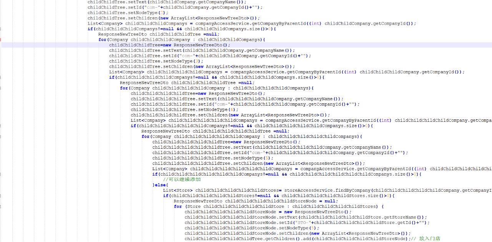
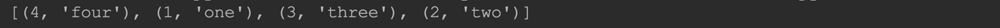

## 五、递归函数

**什么叫递归(`recusive`)?**

你拿两个镜子互相面对着, 然后去看镜子, 会发现每个镜子中很多个镜子, 层层的嵌套, 无穷尽, 这就是一种递归!

从前有坐山, 山里有座庙, 庙里有个老和尚在给小和尚讲故事: 从前有座山.... 如果你小的时候被人忽悠听过这个故事, 这个故事是递归! 

**计算机机中的递归是指: 一个函数在内部自己调用自己, 这就叫函数的递归调用!**

就像前面两种情况一样, 如果不发生点意外, 比如一个镜子被拿走了, 或者老和尚挂了, 则递归无穷尽.

函数递归一样, 也要有终止条件, 否则就是个死循环!

------

**所以, 在编程中使用递归一定要注意:**

一定要有结束条件.

1. 随着递归的深入, 一定要有满足结束条件的情况发生.

------

示例代码：使用递归计算数字的阶乘

```python
def factorial(x):
    """计算参数的阶乘

    计算原理: x! = x * (x - 1)!
    当 x == 1 的时候直接返回 1, 而不必再去计算

    :param x:  要计算阶乘的数字
    :return:  x!
    """
    if x == 1:
        return 1
    return x * factorial(x - 1)


print(factorial(6))
```

------

递归可以大大简化我们的代码
如果你不会用递归, 写出这样的代码, 会被打死的.




## 六、 Lambda表达式

python 对 lambda有比较简单有限的支持.

lambda 表达式只是对简单到只有一行代码的函数的语法糖(简写), 如果有多行代码, 则无法使用 lambda 表达式.

但是在别的语言中, lambda 表达式是比较强悍的.

python 的 lambda 确实比较弱.

**心里时刻想着 lambda 是对只有一行的函数的简写, 你会发现`lambda`表达式真的很简单!**

------

### 6.1 Lambda的语法格式

语法:

```python
lambda 形参列表 : 表达式
```

说明:

1. 关键字`lambda`后面紧跟着形参列表. 注意形参列表不能用圆括号括起来
2. 形参列表后面紧跟着一个冒号(`:`)
3. 冒号后面是唯一的表达式. 注意:此表达式必须是合法的表达式.
4. `lambda`会自动返回表达式的运算结果.

------

### 6.2 返回一个`lambda`表达式

```python
def foo(a):
    return lambda x: x + a


f = foo(30)

print(f(20))
print(f(40))
```

------




