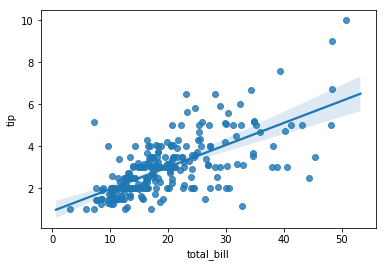
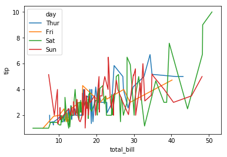

# seaborn入门

**目标：**

1. **eclips安装Django web插件**
2. **seaborn绘图（matplotlib的升级版）**

### 安装django web 插件

-  eclips django web插件
  http://eclipse.kacprzak.org/
  eclips Django Editor
-  Python WEB开发环境搭建及配置五之Eclipse
  http://blog.51cto.com/djangor/1389471

**eclibs python 开发环境搭建**

**eclips+pydev+django Editor(需要手动安装插件)**

**django Editor :django编辑器**

**eclips django web插件网址:**
http://eclipse.kacprzak.org/

**配置:**

http://eclipse.kacprzak.org/updates

## 安装方式:

1. 在线安装插件: help ------>install new Sofoware ------> add -------?>输入插件的名称+插件的网址

2. 离线安装:  pydev 是Eclips开发python的插件!!!

   **解压插件包,复制插件文件(plugin)和特征文件(features)中的文件,到eclips安装目录对应的文件夹中**

# seaborn 绘图

**简介:**

**官网:http://seaborn.pydata.org/**

**简介:seaborn是matplotlib为基础的模板库~内置丰富的绘图样式,效果绚丽,相当于matplotlib的升级版**

**核心网址:**

1. 官网

2. 官网数据源地址:

   **https://github.com/mwaskom/seaborn-data**

3. 方法说明文档(**API手册**):

   **http://seaborn.pydata.org/api.html**

   **seaborn内置读取官方数据源的方法:sns.load.dataset(数据源名称)..seaborn独有的测试数据源库**

# 安装:

**pip install seaborn**

**conda install seaborn**

### 导入

**import seaborn as sns(sns是别名)**

**准备数据,seaborn官方有测试数据集,使用sns.load.dataset('数据集名不带后缀名')**

~~~python
#导入seaborn 
import numpy as np
import pandas as pd
import matplotlib.pyplot as plt
import seaborn as sns

#加载官网测试数据源(鸢尾花iris.csv， 泰坦尼克titanic.csv， 小费数据集：tips.csv)) 读取文件不需要后缀名
tai = sns.load_dataset('iris')
sns.pairplot(tai)
plt.show()
~~~

# seaborn主题设置

**seaborn内置5个主题**

**seaborn在绘图前,建议先设置整体的风格,**

~~~python
#设置主题的方法
sns.set_style('主题名称')
sns.set(style='主题名称')
~~~

**white **

**dark**

whitegrid

ticks

sns.despine()

# seaborn 核心的绘图方法

* **折线:sns.lineplot()**
* **柱状图:sns.barplot()**
* **散点图:sns.scatterplot()**
* **箱图:sns.boxplot()**
* **对比图:sns.pairplot()**
* **直方图:sns.distplot()**
* **小提琴图:sns.violinplot()**
* **点图: sns.pointplot()**
* **绘图工厂:sns.factoryplot(..,kind='box/line/scatter.....')**
* 1. **折线图:  lineplot**
  2. **直方图:  distplot**
  3. **柱状图   barplot**
  4. **方向:    orient='h/v'**
  5. **关联图   jointplot**
  6. **比较图   pairplot**
  7. **回归图:  regplot/lmplot**
  8. **箱图     boxplot**
  9. **分类散点图   stripplot**
  10. **避免重叠散点图   swarmplot**
  11. **调色板   palette**
  12. **设置整体风格  set(style='风格')**
        **sns.set_style('whitegrid',{'font.sans-serif':['simhei','Arial']})**
  13. **设置上下文:   set_context('海报',字体,...)**
  14. **小提琴: violinplot**
  15. **色彩分类:  hue**
  16. **抖动:   jitter**
  17. **统计图  countplot(x=列名,data=数据)**
  18. **点图: pointplot**
  19. **工厂绘图   factorplot   kind='类型'**
  20. **热度图:  heatmap**

# 设置内容/上下文

**sns.set_contern('内置的内容尺寸关键字',font_scale=字体缩放倍数,rc='['lines.linewidth':5]')**

**每个绘图方法,都有调色板属性:palette()**

**papper(纸张),talk(谈话),poster(海报最大),notebook(默认笔记本,表示图大小不一样)**

**设置调色板:set_palette()**

### 精细控制调色板

1. **颜色从深到浅:sns.palette(sms.dark_paletter('red'))**

2. **从浅到深:sns.palette(sms.light_paletter('red'))**

3. **使用:**

   #生成n个颜色
   sns.boxplot(date=数据集,palette=sns.color_palette('hls',N个值整数))

**案例1.风格控制**

**设置坐标系:sns.set_style()**

**设置内容大小:sns.set_context()**

**画图:plt.plot(DataFrame数据集)**

**显示:plt.show()**

**案例2:直方图**

~~~python
#案例2:直方图，重点，了解其中的几个属性　　　　
#bins 范围     
#kde=True 是否显示核密度平谷线  
#hist 是否显示直方柱形图
x = np.random.normal(size=100)
sns.distplot(x,kde=True,bins=20,hist=False,kde_kws={'shade':True})
plt.show()
~~~

#### 案例3 :散点图

~~~python
import numpy as np
import pandas as pd
import matplotlib.pyplot as plt
import seaborn as sns

#3案例演示 散点图   x轴显示列名 y轴显示列名   data 数据源
df = pd.DataFrame(np.random.randn(1000,2),columns=list('AB'))

sns.scatterplot(x='A',y='B',data=df,color='b')
plt.show()
~~~

#### 案例4:联合分布图

~~~python 
#4联合分布图
sns.jointplot(x='A',y='B',data=df,color='k',kind='hex')
plt.show()
~~~

#### 案例5:比较图

~~~python
#5 比较图 绘制2个变量之间的关系  鸢尾花数据集演示
hua = sns.load_dataset('iris')
#第一个参数是数据   第二个参数hue=''给每个类别指定不同的颜色,
#palette='husl/hsl'调色板选择色彩生成方案  
#markers图形标记 markers=['o','s','D']
#vars 指定参数['','',''...........]
sns.pairplot(hua,hue='species',palette='husl',markers=['o','s','D'])
plt.show()
~~~

#### 案例6: 回归分析图

~~~python
#案例6 回归分析图 regplot/implot(建议使用regplot)作用绘制2个变量之间的数据分布趋势图,一般用在散点图上,绘制的规律线全名:回归分析图
#两者间主要的区别是，regplot接受各种格式的x y，包括numpy arrays ,pandas series 或者pandas Dataframe对 象。
#相比之下,lmplot()只接受字符串对象。这种数据格式被称为’long-form’或者’tidy’。
#除了输入数据的便利性外， regplot()可以看做拥有lmplot()特征的一个子集.

"""
总账单和小费之间的关系  数据集 tips
fit_reg=False 回归线不显示
"""
tips = sns.load_dataset('tips')
sns.regplot(x='total_bill',y='tip',data=tips,fit_reg=True)
plt.plot()
~~~

#### 案例7.折线图

~~~python
#折线图 lineplot()
tips = sns.load_dataset('tips')
"""
消费总账单和小费之间的关系
hue 不同类别显示不同颜色,hue = 'time'按照什么什么分类
"""
sns.lineplot(x='total_bill',y='tip',data=tips,hue='time')
plt.show()
~~~

~~~python
"""
不同日期的消费情况和小费的关系
"""
sns.lineplot(x='total_bill',y='tip',data=tips,hue='day')
plt.show()
~~~

#### 案例8 点图绘制

~~~python
#案例8 点图绘制
"""
就餐时间和总账单的关系 
hue='smoker' 按照是否抽烟分组 
dodge=True 分开显示
join=False  是否连接
"""
tips = sns.load_dataset('tips')
sns.pointplot(x='time',y='total_bill',data=tips,hue='smoker',dodge=True,join=True)
plt.show()
~~~

#### 案例9分类散点图

~~~python
#案例9:分类散点图
"""
每天的总账单
jitter=False  晃动 偏移属性
"""
tips = sns.load_dataset('tips')
sns.stripplot(x='day',y='total_bill',data=tips,jitter=True)
plt.show()
~~~

~~~python
"""
带漂移的散点图   不重合算法
"""
tips = sns.load_dataset('tips')
sns.swarmplot(x='day',y='total_bill',data=tips)
plt.show()
~~~

~~~python
"""
带漂移的散点图   不重合算法
每天男女的消费账单
"""
tips = sns.load_dataset('tips')
sns.swarmplot(x='day',y='total_bill',data=tips,hue='sex')
plt.show()
~~~

#### 10案例泰塔尼克号男女获救

~~~python
#案例10 泰塔尼克号男女获救
"""

"""
tai = sns.load_dataset('titanic')
sns.barplot(x='sex',y='survived',data=tai)
plt.show()
~~~

#### 案例11 每个登录地点的总人数

~~~python
#案例11 每个登录地点的总人数

tai = sns.load_dataset('titanic')
sns.countplot(x='embarked',data=tai)
plt.show()
~~~

#### 案例12绘图工厂

~~~python
#12绘图工厂
"""
,kind='box'   
"""
sns.factorplot(x='time',y='total_bill',hue='smoker',data=tips,kind='box')
plt.show()
~~~

# 总结

1. eclips插件
2. seaborn绘图

